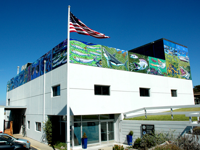

## New West Coast Indices

::::: {layout-ncol=2}

::: {}

The Environmental Resources Division of the Southwest Fisheries Science Center (ERD) was originally formed in 1969 as the Pacific Environmental Group (PEG) at the U.S. Navy Fleet Numerical Meteorology and Oceanography Center ([FNMOC](https://www.metoc.navy.mil/fnmoc/fnmoc.html)) to take advantage of the Navy's global oceanographic and meteorological databases (@clancy92, @rosmond92). FNMOC produces operational forecasts of the state of the atmosphere and the ocean several times daily from which ERD derives a number of environmental data products and indices. PEG was renamed as the Pacific Fisheries Environmental Group (PFEG), and later to the Pacific Fisheries Environmental Laboratory (PFEL) before becoming ERD, but the relationship with FNMOC continues.

FNMOC global model forecasts are acquired 6-hourly and are available on ERD's ERDDAP server. These data and derived global gridded products such as monthly summaries and transports are described in this section.  Environmantal index products, notably upwelling calculated by ERD at standard locations are described in the [Bakun upwelling index section](/projects/upwelling/bakun.html)

:::

:::::

## References

::: {#refs}
:::
