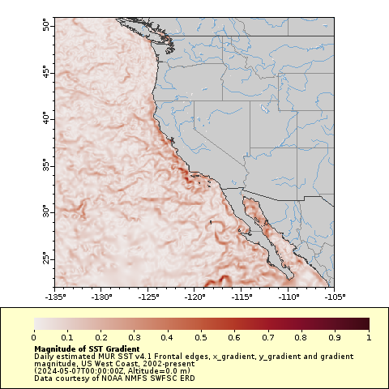

## About

Front Edges were estimated from daily Multi-scale Ultra-high Resolution (MUR) Sea Surface Temperature (SST) v4.1 files using the Python scikit-image canny algorithm with sigma = 10., and threshold values of .8 and .9, as well as the OpenCV algorithm findContours with a minimum length of 20. The SST x-gradient, y-gradient and gradient magnitude are also included. Frontal edges are calculated for the US West Coast, 2002-present, and along the US Atlantic Coast, 2003 - present.

## Download

::::: {layout-ncol=2}

::: {}

[Download and subset on ERDDAP&#8482;](https://coastwatch.pfeg.noaa.gov/erddap/griddap/erdMurFront41USWest.graph)

:::

::: {}

[Download and subset on ERDDAP&#8482;](https://coastwatch.pfeg.noaa.gov/erddap/griddap/erdMurFront41USAtlantic_Lon0360.graph)

:::

:::::

## Calculation resources

Details of the frontal edge calculation, including the python functions and libraries used in the calculation, suggestions for selecting the parameters, and instructions for downloading the MUR data can be found at  [https://rmendels.github.io/canny_doc.html](https://rmendels.github.io/canny_doc.html)
