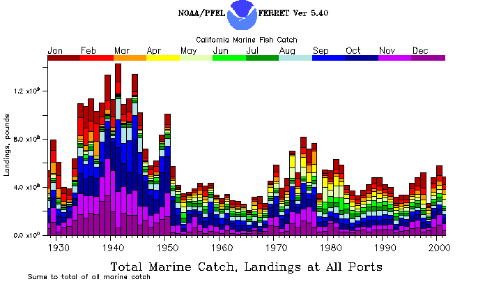

## California Commercial Landings Database

::::: {layout-ncol=2}

::: {}

This database (@mason04) includes only fish and invertebrates caught off California and landed in California.  It includes neither offshore foreign fisheries landed outside California, nor tropical tuna fisheries landed in California.  It does include commercial freshwater catches in California through but not after 1971.  It includes some but not all maricultured shellfish such as oysters through 1980.  It has spatial resolution only to the extent that fish caught off California and landed in a port region were presumed to be caught in that region.  This assumption may not be valid for boats traveling long distances to fish.

:::



:::::

## Geographic Regions

Only landings caught off California appear in this data series, not landings of species caught north or south of the state boundaries.

These are the 6 regions we have used throughout the time series:
- Eureka (Del Norte, Humbolt and Mendocino Counties)
- San Francisco (Sonoma, Marin, San Mateo, and San Francisco Counties, San Francisco Bay)
- Monterey (Santa Cruz and Monterey Counties)
- Santa Barbara (San Luis Obispo Santa Barbara and Ventura Counties)
- Los Angeles (Los Angeles and Orange Counties)
- San Diego (San Diego County)

The only region that is not consistent is San Francisco.  Landings from a 7th region called Sacramento were combined with San Francisco in our tables from 1928 to 1971. Sacramento region included landings from San Pablo and Susuin Bays, Sacramento and San Joaquin Rivers and Delta and inland lakes.  Sacramento region also included river caught salmon and some marine fish (primarily sardine) caught in the San Francisco marine region but transported to Sacramento canneries from 1931 to 1950. This plus the merger of Sacramento landings with San Francisco in published tables after the Sacramento River closed to gill nets in Sept 1957, led to our including Sacramento in the San Francisco landings.  Sacramento landings and freshwater species in general are not in our data series from 1972 onward.

## Species Names and Grouping

Landings can be accessed using two different lists. The short list of 57 names combines some later categories to match the earlier groupings to produce as many long time series as possible. The long list of 336 names, on the other hand, tries to maximize the distinction of different species.

Common names are used for types of fish sold to fish markets in California, also called market categories.  More than one species may be present in a market category.  If the species are known, they will be listed in the information about that market category. The number of categories has increased over time as more species were separated by the markets. Categories for rockfish are particularly mixed.

## Short list of names

The following short list of 57 names combines some later categories to match the earlier groupings to produce as many long time series as possible (i.e. sole on the short list includes all species that were grouped together before 1953, even those species sold seperately after 1953). The short list does not include some less abundant categories and does not sum to the total California landings.

::: {.callout-note icon=false collapse=true appearance="minimal"}

## Click to view short list of species names

::: {#short}
:::

:::


## Click to view long list of species names

The following long list of 336 names tries to maximize the distinction of different species.  Scientific names are provided when known.  Categories are combined only if no resolution is lost.  This produces shorter time series for some categories but the most differentiation of species available.  Categories in the long list should sum to the total California landings for each year.

::: {.callout-note icon=false collapse=true appearance="minimal"}

## Long List

::: {#long}
:::

:::


## Source of Data

The [California Department of Fish and Wildlife](https://www.wildlife.ca.gov") (DFW) is the ultimate source of all the California commercial landings information.  The data come form receipts or "fish-tickets" filled out by the markets and packing facilities as required by the state for all commercial landings. The California Department of Fish and Wildlife published tables of monthly commercial landings beginning with 1928 in their Fish Bulletin series. The Fish Bulletin series continued to provide monthly landings through 1976. From 1977 to 1986 only a summary of annual catches was published in the Fish Bulletin series no. 173. Comparable monthly landings for 1977 through 1980 were obtained by personal communication from California Department of Fish and Game Statistical Division.  Landings for 1981 to present, collected by California Department of Fish and Game, were obtained by request from Pacific Fisheries Information Network (PacFIN) to duplicate the parameters of the previous tables (only landings caught off California were included, not north or south of the state boundaries, and landings were grouped into the 6 port regions by month). There is considerable information in the California Fish and Game's Fish Bulletin Series that is useful in interpreting the landings.  Certain Bulletins give an overview of the various categories at the time, especially Fish Bulletins 49 (1936), 74 (1949), 149 (1970).  Fish Bulletin 161 contains designated common names and their scientific equivalents. Other bulletins treat a particular fishery in depth.  The Fish Bulletin Series is being digitized and will soon be online.  Some of this fishery information has been brought up to date in *California's Living Marine Resources: A Status* (@leet01)

## References

::: {#refs}
:::


```{=html}
<style>
/* Hide Quarto's native right sidebar category menu completely */
#quarto-sidebar-toc-left, 
.quarto-listing-category-toggle,
.quarto-listing-category {
  display: none !important;
}

</style
```
