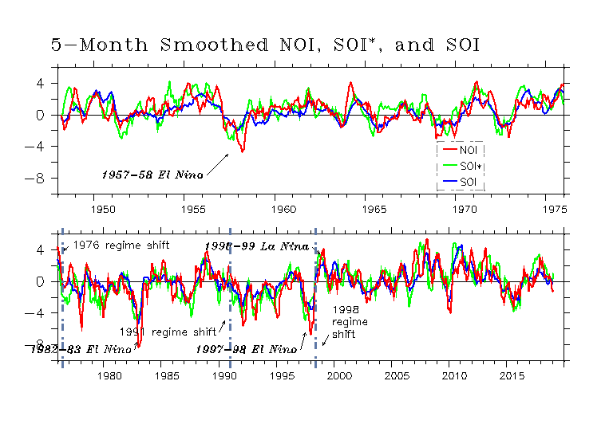
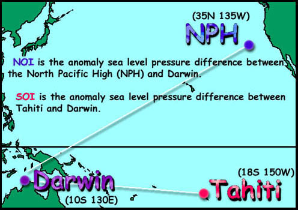
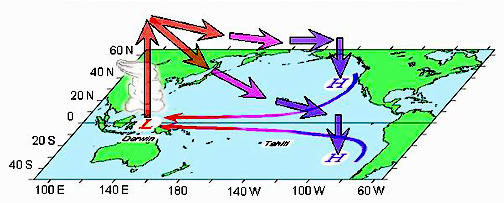
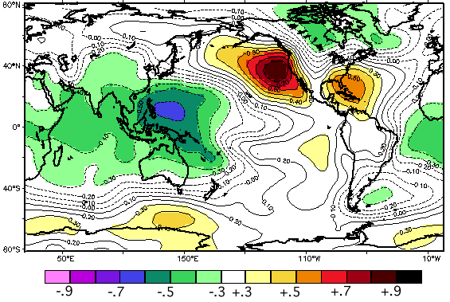

## About the NOI

::::: {layout-ncol=2}

::: {}

The NOI (extratropical-based Northern Oscillation Index) and its analog, the SOI* (extratropical-based Southern Oscillation Index) are indices of midlatitude climate fluctuations that show interesting relationships with fluctuations in marine ecosystems and populations (@schwing02). They reflect the variability in equatorial and extratropical teleconnections and represent a wide range of local and remote climate signals. The indices are counterparts to the traditional SOI (Southern Oscillation Index) that relate variability in the atmospheric forcing of climate change in northern and southern midlatitude hemisphere regions.

:::

:::::

## Computation

NOI and the SOI* are computed from NCEP sea level pressure anomalies (SLPA) (monthly sea level pressure minus climatology) of the North Pacific High (**NPH**) [35N,130W], South Pacific High  (**SPH**) [30S,95W], **Darwin** [10S,130E], and **Tahiti** [18S,150W]. The NOI,  SOI*, and SOI are created as follows:

<table border=1 cellspacing=5><tr><td>**NOI = SLPA_NPH - SLPA_DARWIN** </td></tr><tr><td>**SOI* = SLPA_SPH - SLPA_DARWIN** </td></tr><tr><td>**SOI = SLPA_TAHITI - SLPA_DARWIN** </td></tr></table>

The definitions used to calculate the NOI and SOI* differ slightly from the traditional definition of the SOI (Chelliah 1990), in that neither the pressure series nor the indices are normalized. We compute a version of the SOI consistent with the NOI and SOI*. The base period we used for the climatologies is January 1948 to December 1997.

## NOI vs SOI

::::: {layout-ncol=2}

::: {}

The SOI is a good indicator of tropical variations related to El Ni&ntilde;o and La Ni&ntilde;a, but it may not be the best way to represent global interannual to decadal variability, particularly at extratropical latitudes because:

- The extratropical impacts of El Ni&ntilde;o/La Ni&ntilde;a are  poorly understood and more correlative than mechanistically linked
- The SOI does not have a direct physical link to the northeast Pacific region.
- It is more straightforward and intuitive to use an index that complements the SOI, but also has a physical connection to the extratropics. Alternatives and supplements to the SOI should be considered, both for extratropical diagnosis of interannual/decadal variability and to better understand the processes responsible for global-scale shifts in atmospheric and oceanic conditions.
- The NOI is a reliable indicator for monitoring and predicting climate fluctuations, and their physical and biological consequences in the Northeast Pacific.

:::

::::

## Background

::::: {layout-ncol=2}

::: {}

The tropics and extratropics are closely linked via the atmospheric Hadley-Walker circulation (@fig-HWcirc). Trade winds from the North and South Pacific Highs **(H)** warm as they move toward a low **(L)** in the western tropical Pacific. Rising warm, moist air feeds tropospheric winds that return to the extratropics via the Hadley-Walker circulation. This air gradually cools and sinks as it moves to the northeast and southeast, supplying mass to the highs **(H)** that are the sources of the trade winds, important vectors for the transport of momentum, energy, and mass between the tropics and extratropics. During a La Ni&ntilde;a (El Ni&ntilde;o) this circulation is stronger (weaker).

:::

{#fig-HWcirc .lightbox}

::::

:::: {layout-ncol=2}

::: {}

On interannual time scales, SLP anomalies at the NPH and SPH are have the opposite sign of those over the western tropical Pacific-southeast Asia, as shown in @fig-slp.

Areas significantly correlated with the NPH are shaded. The two regions of positive correlation (yellow-red) in the northeast and southeast Pacific, and the large region of negative correlation (green-blue) in the western tropical Pacific show that interannual changes in the NPH are strongly coupled with variations in the Hadley-Walker circulation. (Figure based on image provided by the NOAA-CIRES Climate Diagnostics Center, Boulder Colorado ([http://www.cdc.noaa.gov/](https://www.cdc.noaa.gov)).

:::

{#fig-slp .lightbox}

::::

The tropical-based SOI emphasizes variations in the zonal Walker circulation. However the SOI tells little about the meridional circulation (the Hadley cells) and its variability, which is an important link between the tropical and mid-latitude atmosphere. The Hadley circulation is specifically associated with the trade winds, which emanate from the extratropical high pressure systems, including the NPH and SPH. The upper level Hadley circulation feeds into the extratropical highs.

Likewise, a number of extratropical teleconnection indices relate information about zonal or higher-latitude atmospheric connections, but do not clearly describe tropical-extratropical or cross-equatorial teleconnections. Extratropical indices do not reflect variability in the trade winds, important vectors for the transport of momentum, energy, and mass between the tropics and extratropics. The difference in SLP between the extratropical NPH (SPH) and Darwin, the NOI (SOI*), is an index of the Pacific trades, and is a clear index of meridional as well as zonal atmospheric patterns.

## References

::: {#refs}
:::

