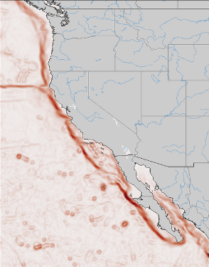

## About

::::: {layout-ncol=2}

::: {}

Two estimates have been developed of the seafloor gradient off the West Coast of the United States using the ETOPO and SRTM30Plus datasets. Each provides estimates of the x-gradient, y-gradient, and magnitude of the gradient. All estimates were done using algorithms in standard Python scikit-image package.

Seafloor gradients are used in habitat studies both to estimate the shelf location as well as to estimate underwater features such as seamounts.
:::

:::::

## Calculation resources

Details of the sea floor gradient calculation,  can be found at [https://rmendels.github.io/seafloor_gradient_doc.html](https://rmendels.github.io/seafloor_gradient_doc.html)
