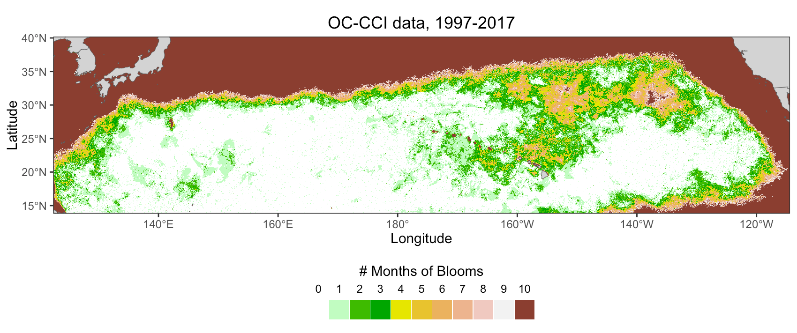



## Recent conditions

```{r}
#| echo: false
#| results: 'asis'

lastdate <- get_dataset_max_date(satdata$dset[length(satdata$dset)])
lastweek <- get_dataset_max_date(satwkdata$dset)
currentinfo <- gettimes(lastdate,months,satdata)

currentmonths <- currentinfo$currentmonths
lastsaturl <- currentinfo$lastsaturl
weeklyurlim <- getweeklyurl('png',0, satwkdata)
weeklyurl <- getweeklyurl('graph',1, satwkdata)

for(i in seq_along(currentmonths)){
  mon <- currentmonths[[i]]$id
  cat("**",currentmonths[[i]]$name, currentinfo$curyr,"**\n\n",sep="")
  cat(",")\n\n",sep="")
}
cat(currentinfo$imgtime,":  [ERDDAP&#8482; download](",lastsaturl,")","\n\n",sep="")

cat("**",lastweek,"**\n\n",sep="")
cat("\n\n",sep="")
cat(satwkdata$name,":  [ERDDAP&#8482; download](",weeklyurl,")","\n\n",sep="")

```


## Bloom Location and Timing

The blooms develop in a very specific locality. The most intense and the most frequent blooms occur between 130&deg;-150&deg;W and 28&deg;-32&deg; N, but blooms also develop due north of Hawaii. The time integrated location of the blooms can be seen in the figure which shows the number of times when chl values &gt; 0.1 mg/m3 occurred in the Pacific during July-Oct from 1997-2017.

Phytoplankton blooms in the ocean usually occur in spring or fall when there is temporal overlap between nutrient injection into the surface mixed layer from mixing, sufficient light levels for photosynthesis, and decreased grazing to allow net biomass accumulation. The chlorophyll blooms that occur in the open NE Pacific are unusual in that they develop in late summer, July-Oct during the seasonal stratification maximum. The NE Pacific in unique in having late summer blooms consistently occur almost every year in the same general area (@wilson08a).

{.lightbox}

## Bloom Forcing

The blooms along 30&deg;N are often made up of diatom-diazotroph assemblages (DDAs) (@villareal11; @villareal12);.  *Hemiaulus* and *Rhizosolenia* diatoms occur in this region containing the diazotrophic endosymbiont  *Richelia*.  *Richelia* release fixed nitrogen as ammonium or dissolved organic nitrogen, which is then available to the host diatom. Nitrogen-fixing diatom symbioses (diatom-diazotroph associations: DDAs) often increase 102–103 fold in these blooms and contribute to elevated export flux.  Diazotophy mitigates nitrate-base nutrient limitation but phytoplankton growth will still be controlled by the amount of phosphate and or silicate.  This part of the ocean does not appear to be iron limited.

Episodic injections of subsurface nutrients are likely the cause of these blooms but the exact mechanism is unknown. Suggested mechanisms include dynamics associated with the convergent zone (@wilson08), the subtropical front (STF) (@wilson03; @wilson08), the breaking of internal waves at the critical latitude (@wilson11), eddy interactions (@calil10; @fong08; @guidi12) dust deposition (@calil11) and winter mixing of phosphate into the mixed layer (@dore08). Most of the proposed mechanisms of nutrient injection are impossible to investigate without in-situ data, which is difficult to obtain in this relatively isolated part of the ocean. We have been involved in a few missions to collect in situ data, see Mission section.

## References

::: {#refs}
:::


