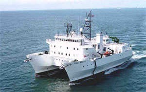
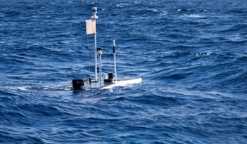
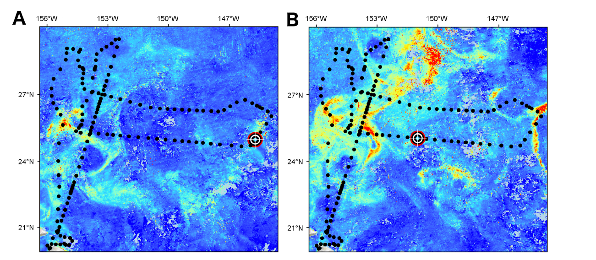

## Phytoplankton biomass and species composition

### R/V *Kilo Moana* cruises

::::: {layout-ncol=2}

::: {}

In 2008 and 2009 cruises on the R/V *Kilo Moana* investigated silicon cycling in the Pacific, with Mark Brzezinski as the PI. The objective of these cruises was to sample satellite ocean color features for phytoplankton biomass and species composition, and daily satellite ocean color imagery was used to determine the station sampling. The KM08 cruise took place on 1– 22 July 2008. A chlorophyll bloom was developing as the ship left port and was sampled during the cruise. near 31&deg;N, 140&deg;W.  The KM09 cruise took place on 29 July to 14 August 2009.  During this cruise, a transect was conducted along 26&deg;N near 145&deg;W, which was the region of a large chlorophyll bloom that had collapsed a week prior to occupation. A small chlorophyll bloom developed during the cruise further south near Hawaii at 155&deg; W, and two stations were occupied in this active bloom during its peak. In both years, DDAs (diatom-diazotroph associations) of *Hemiaulus*-*Richelia* and *Rhizosolenia*-*Richelia* increased 102–103 over background concentrations within the satellite-defined bloom features (@villareal12).  The larger blooms sampled in 2008 and 2009 were both located near the subtropical front, which is characteristic of these blooms (@wilson13).

:::

:::::

## Wave glider chlorophyll bloom observations

### Magi project

::::: {layout-ncol=2}

::: {}

In summer 2015, a proof-of-concept mission using the autonomous vehicle, *Honey Badger* (Wave Glider SV2; Liquid Robotics, a Boeing company, Sunnyvale, CA, USA), collected near-surface (<20 m) observations in the eastern North Pacific sub-tropical gyre using hydrographic, meteorological, optical, and imaging sensors designed to focus on phytoplankton abundance, distribution, and physiology in this bloom-forming region. Hemiaulus and *Rhizosolenia* cell abundance was determined using digital holography for the entire June–November mission. While *Honey Badger* was not able to reach the 30&deg;N subtropical front region where most of the satellite chl a blooms have been observed, near-real time navigational control allowed it to transect two blooms near 25&deg;N. The two taxa did not co-occur in large numbers, rather the blooms were dominated by either *Hemiaulus* or *Rhizosolenia*. The August 2–4, 2015 bloom was comprised of 96% *Hemiaulus* and the second bloom, August 15–17, 2015, was dominated by *Rhizosolenia* (75%). The holograms also imaged undisturbed, fragile *Hemiaulus* aggregates throughout the area.

:::

:::::

During the 5-month mission, *Honey Badger* covered ∼5,690 km (3,070 nautical miles), acquired 9,336 holograms, and reliably transmitted data onshore in near real-time.

::::: {layout-ncol=2}

::: {}

Liquid Robotics provided the glider time at no cost as part of the PacX Challenge award.  This award was given to Tracy Villareal and Cara Wilson based on the manuscript they wrote using wave glider data from the PacX mission (@villareal14).

:::

{.lightbox}

::::

## References

::: {#refs}
:::

