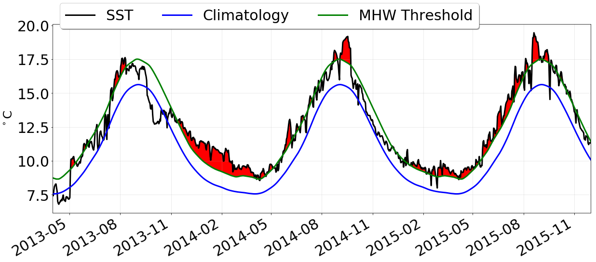
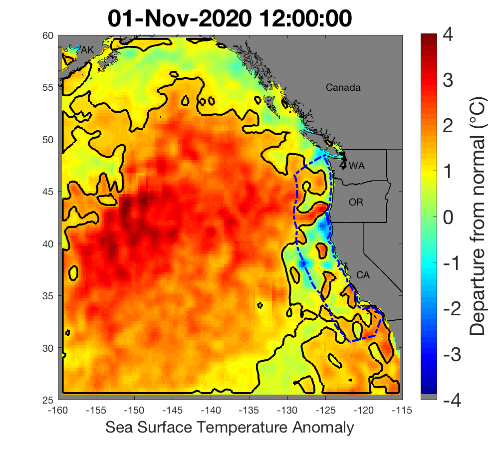
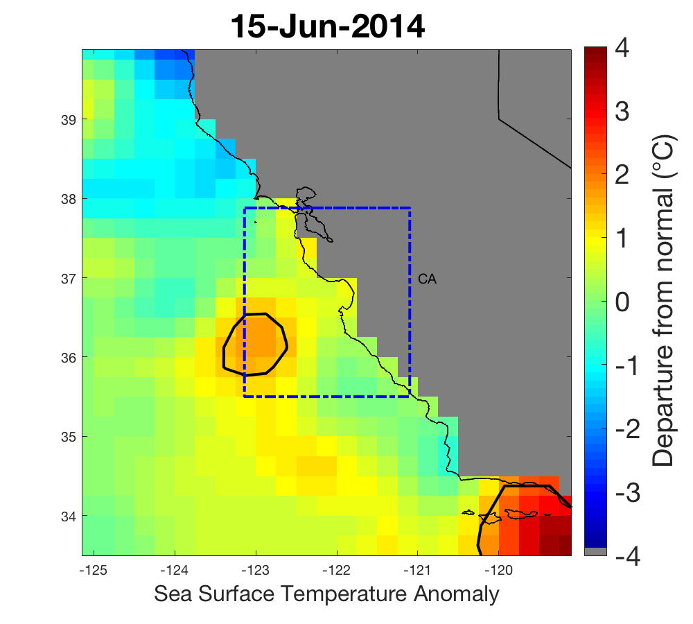
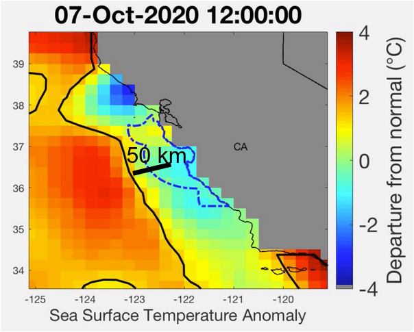
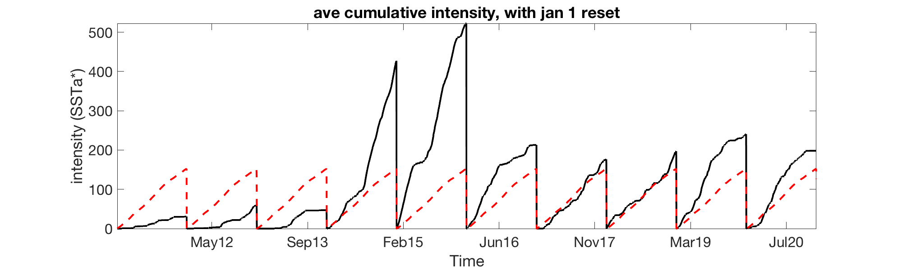
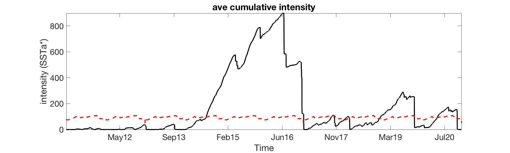

```{=html}
<style>
/* Style section wrappers generated by Quarto as standalone cards */
main .level2 {
  background-color: #fff;
  border-radius: 10px;
  padding: 1.5rem;
  margin-bottom: 1.5rem;
  box-shadow: 0 4px 8px rgba(0,0,0,0.15);
  transition: transform 0.2s ease;
}

main .level2:hover {
  transform: translateY(-4px);
}

.icon {
  line-height: 1;
  margin-bottom: 0.6rem;
  max-width: 500px;
}

.icon-tiny {
  line-height: 1;
  margin-bottom: 0.6rem;
  max-width: 300px;
}
.title {
  font-weight: 600;
  font-size: 1rem;
  opacity: 0.9;
  color: black;
}
.details {
  font-size: 0.9rem;
  opacity: 0.9;
  line-height: 1.3;
  color: black;
}
</style>

```

## What is a marine heatwave (MHW)?

::: {.icon}

:::

::: {.details}
<p>[Marine heatwaves](http://www.marineheatwaves.org/), or MHWs, occur when ocean temperatures are much warmer than usual for an extended period of time; they are specifically defined by differences in expected temperatures for the location and time of year.1 MHWs are a growing field of study worldwide because of their effects on ecosystem structure, biodiversity, and regional economies.</p>
<p>In 2014 a large MHW was identified as it began dominating the northeast Pacific Ocean. Eventually known as "the blob" (Fig. 3), that basin-scale MHW was unique in the history of monitoring in the California Current, and persisted until mid-2016. Researchers documented many ecological effects associated with the blob, including unprecedented harmful algal blooms, shifting distributions of marine life, and changes in the marine food web.</p>
<p>For recent comparison, the Northeast Pacific Marine Heatwave of 2019, also known as NEP19 (Fig. 3B) was the 3rd largest and longest event recorded in the northern Pacific Ocean since 1982, when satellite-based remote sensing of sea surface temperatures began in a consistent fashion. NEP19 lasted 239 days and covered approximately 8.5 million km2 at its peak (archived images can be found here); it officially fell below our heat wave classification thresholds, and ended in terms of its surface expression, on January 17, 2020. Marine heatwave NEP20b, which began in May 2020 and reached a maximum size of ~9.1 million km2 in late September 2020, fell below the area threshold (400,000 km2) for classification as a large marine heatwave on April 4, 2021 (Fig. 4B). At its maximum size, NEP20b was the 2nd largest MHW (by a slight margin) seen in this region since satellite monitoring and analysis began in 1982 (Fig. 4A). It is also now one of the longest lasting heatwaves on record, having lasted 309 days.
</p>

:::

## What makes a heatwave?
::: {.icon}

:::

::: {.details}
<ul><li>The blue line is the average Sea Surface Temperature (SST) for each day of the year over time (also known as the climatology).  </li><li>The black line is the actual SST on any particular day, with the difference between the blue and black known as SST anomaly. </li><li>The green line is the heatwave threshold. </li><li>Whenever the black line exceeds the green line for &gt; 5 days, that denotes a marine heatwave (denoted by red fill), this occurs regardless of the <i>absolute </i>temperature… i.e. why we can get "heatwaves" in the winter, even though it is not warm</li></ul>
:::

## Tracking heatwaves

::: {.icon}

:::

::: {.details}
Following Hobday et al.’s, (2016) suggestion, any particular location is considered to be a heatwave if its temperature exceeds 90% of all measured temperatures at that location for that day of the year, for at least 5 days in a row. Here, we make a slight adjustment by first standardizing the SSTa by the standard deviation of SSTa at each location for each day of the year, resulting in a new metric SSTa*. Any particular location is then considered in "heatwave status" if its value of SSTa* is &gt; 1.29 (this threshold "intensity" is the exact parametric equivalent to the 90% threshold suggested by Hobday et a., 2016). Lastly, individual heatwave "events" are tracked over time by grouping together all contiguous locations exceeding the intensity threshold, noting the area, spatially-averaged intensity, centroid, and distance from the US west coast.  Only those events with an area &gt; 400,000 km<sup>2</sup> are tracked in this fashion (the top 15% of all heatwaves by area).
:::

## Regional Metric Calculations

::: {.icon}

:::

::: {.icon}

:::

::: {.icon}

:::

::: {.icon}

:::

::: {.details}
<p><b>1) % Heatwave Coverage</b> = % of ocean area within the "black boundary" that is in "heatwave status" <i>Thus this indicator tells you how much of your region is currently considered in a heatwave.</i></p><p><b>2) Spatial Ave intensity</b> = average SSTa* of all pixels in blue box that are also &gt; HW threshold (i.e. the spots within the black outline).  <i>Thus this indicator tells you just how much "hotter" than normal the heatwave is, for comparison with other heatwaves over time.</i></p><p>
<b>3) Distance index</b> This index is calculated as the distance between the center of the chosen region, and the edge of the nearest “major” large marine heatwave.  A heatwave is considered to be “major” if its area > 400,000 km<sup>2</sup>.  This threshold represents the top 15% of all marine heatwaves on record, and is the same threshold used for tracking and monitoring of large marine heatwaves most likely to impact the US west coast (see: <a href="https://www.integratedecosystemassessment.noaa.gov/regions/california-current/california-current-marine-heatwave-tracker-blobtracker" target="_blank">CCIEA Blobtracker website</a> for more details).</p><p>When the value of this index is small, it means that the heat within the chosen region is driven by a nearby large marine heatwave.  When the value of this index is large, but there is coverage within the region, this means that the heating is local.  When there is no value of this index, it means that there is no currently tracked major heatwave across the entire NEP.</p><p><i>Thus, this index is an attempt to show whether anomalous heat within the chosen region is locally generated, or is part of a much large, possibly basin-wide feature.</i></p>
<p><b>4) Annual Cumulative Intensity Index</b> This is similar to "heating degree days". This is calculated by summing daily over time, at each pixel, the value of SSTa* whenever it is &gt; 0, and then averaging these values spatially within the chosen region, only for those locations that have a positive anomaly.  Important to note, <i>does not</i> depend on the semi-arbitrary "heatwave status" threshold.  <i>Thus, this index is an indicator of how much accumulated "heat" a region has "felt" over a given period of time, compared to the climatological average.</i></p>
<p><b>5) Biweekly cumulative intensity index</b> Same as above, however, the cumulative value is reset to zero for any particular pixel whenever there is a stretch of time &gt; 14 days with no positive anomalies in SST.  <i>Thus, this index may be more appropriate in terms of the scales over which organisms might experience the cumulative "heat load" of warm-water events.</i></p>
:::

## What is the MHW Tracker?

::: {.details}
<p>Developed by oceanographers from NOAA Fisheries’ Southwest Fisheries Science Center as an experimental tool for natural resource managers, the California Current MHW Tracker is a program designed to understand, describe, and provide a historical context for the 2014-16 blob.<sup>2</sup> It also produces a range of indices that could help forecast or predict future MHWs expected to impact our coast.</p><p>Because the blob dramatically affected natural resources, including economically valuable fisheries, predictive forecasts will help natural resource managers, businesses, and coastal communities anticipate changes and mitigate possible damages in the future.</p><p>The California Current MHW Tracker automatically analyzes sea surface temperature anomalies (SSTa) from 1984- present, with a particular focus on detecting the presence of significant "blob-class" events. Sea surface temperature (SST) data were obtained from a variety of different platforms (satellites, ships, buoys) on a regular global grid at a resolution of 1/4&deg;.</p><p>We found that blob-class MHWs can be classified based on their strength (&gt;1.29 times the standard deviation of the SSTa field; e.g., the top 90% of the data), along with their areal extent, and duration. The original 2014-16 blob had contiguous patches which lasted more than six months and were &gt;4,500,000 km<sup>2</sup> in area. Based on our thresholding criteria, we suggest that the MHWs most likely to cause impacts to the west coast will be roughly 3 x the area of Alaska, come within 250 km of the coast, and last at least three months.</p><p><b>Project leads:</b> Andrew Leising and Steven Bograd (SWFSC)</p>
:::

## More MHW information

::: {.details}
California Current Integrated Ecosystem Assessment (CCIEA) <a href="https://www.integratedecosystemassessment.noaa.gov/regions/california-current/cc-projects-blobtracker">project page</a>
:::

