```{=html}
<style>
/* Style section wrappers generated by Quarto as standalone cards */
main .level2 {
  background-color: #fff;
  border-radius: 10px;
  padding: 1.5rem;
  margin-bottom: 1.5rem;
  box-shadow: 0 4px 8px rgba(0,0,0,0.15);
  transition: transform 0.2s ease;
}

main .level2:hover {
  transform: translateY(-4px);
}

.icon {
  line-height: 1;
  margin-bottom: 0.6rem;
  max-width: 900px;
}

.icon-tiny {
  line-height: 1;
  margin-bottom: 0.6rem;
  max-width: 300px;
}
</style>
```


## West Coast

::: {.icon}

:::

## Washington

::: {.icon-tiny}
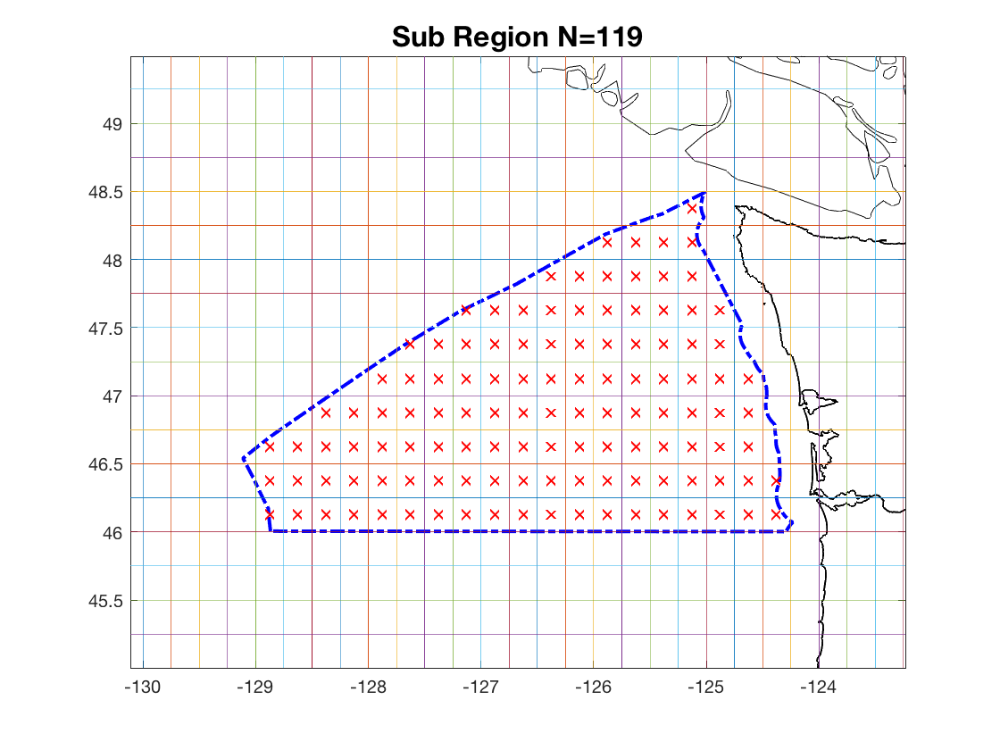
:::

[Download Washington daily data](https://oceanview.pfeg.noaa.gov/erddap/tabledap/cciea_OC_MHW_regions.graph?time%2Cheatwave_cover%2C&region=%22wa%22&.draw=lines&.marker=5%7C5&.color=0x000000&.colorBar=%7C%7C%7C%7C%7C&.bgColor=0xffccccff")

::: {.icon}
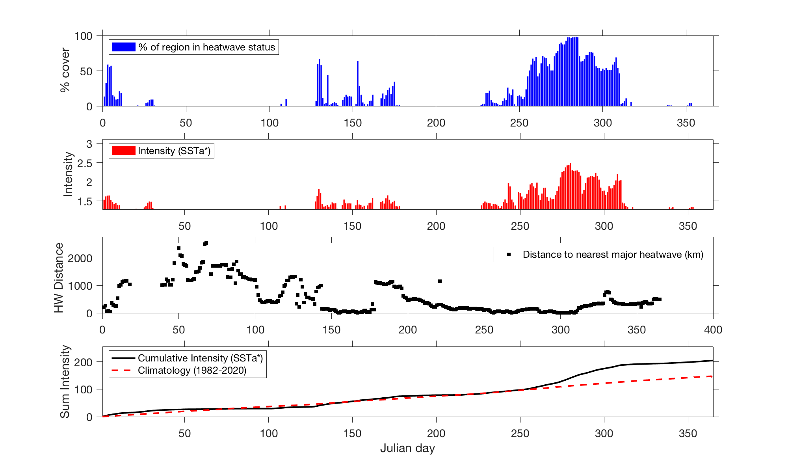
:::

::: {.icon}
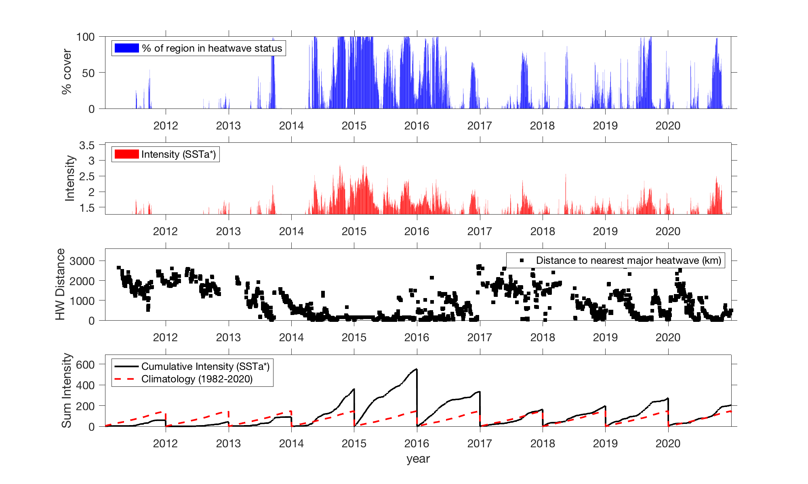
:::

## Oregon

::: {.icon-tiny}
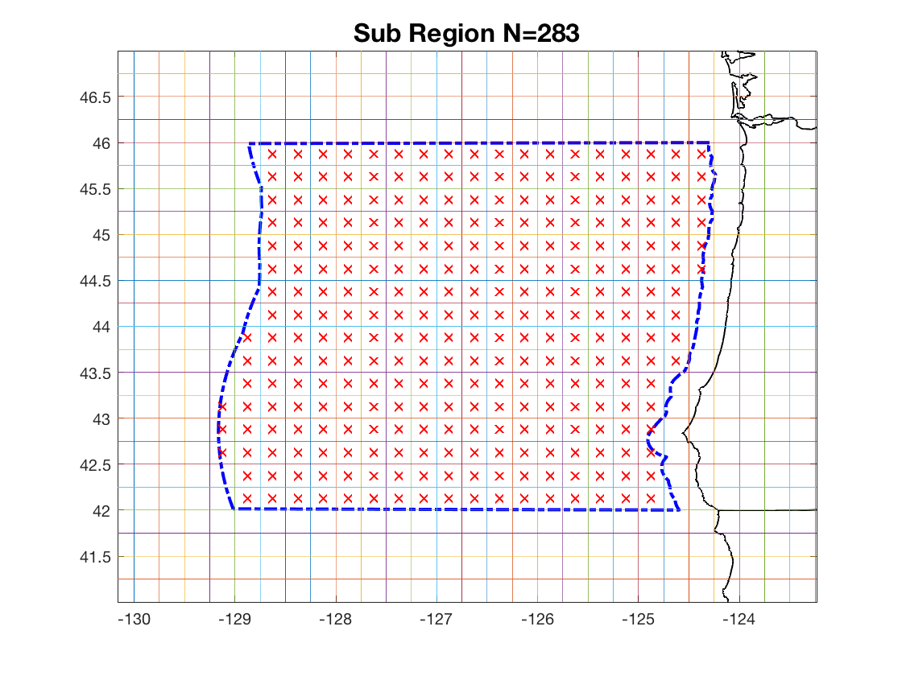
:::

[Download Oregon daily data](https://oceanview.pfeg.noaa.gov/erddap/tabledap/cciea_OC_MHW_regions.graph?time%2Cheatwave_cover%2C&region=%22or%22&.draw=lines&.marker=5%7C5&.color=0x000000&.colorBar=%7C%7C%7C%7C%7C&.bgColor=0xffccccff")

::: {.icon}
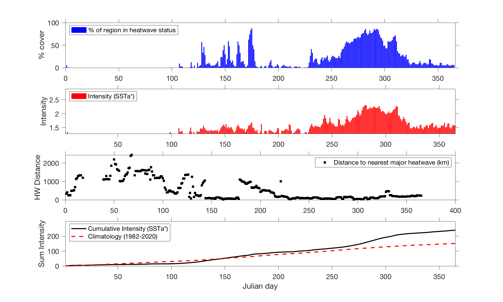
:::

::: {.icon}
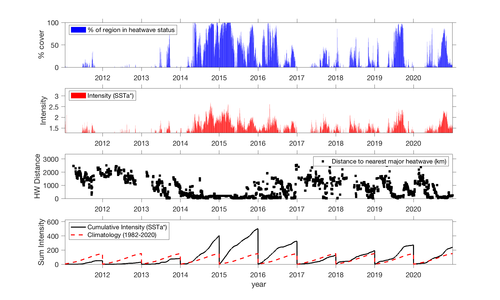
:::

## Northern California

::: {.icon-tiny}
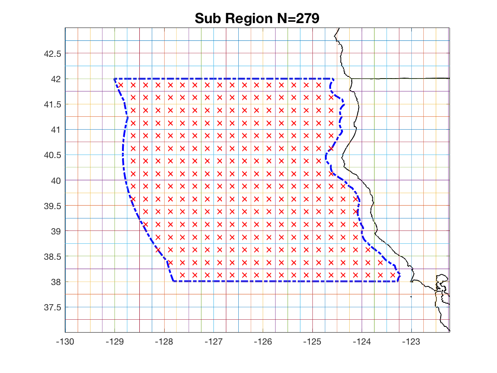
:::

[Download Northern California daily data](https://oceanview.pfeg.noaa.gov/erddap/tabledap/cciea_OC_MHW_regions.graph?time%2Cheatwave_cover%2C&region=%22norcal%22&.draw=lines&.marker=5%7C5&.color=0x000000&.colorBar=%7C%7C%7C%7C%7C&.bgColor=0xffccccff")

::: {.icon}
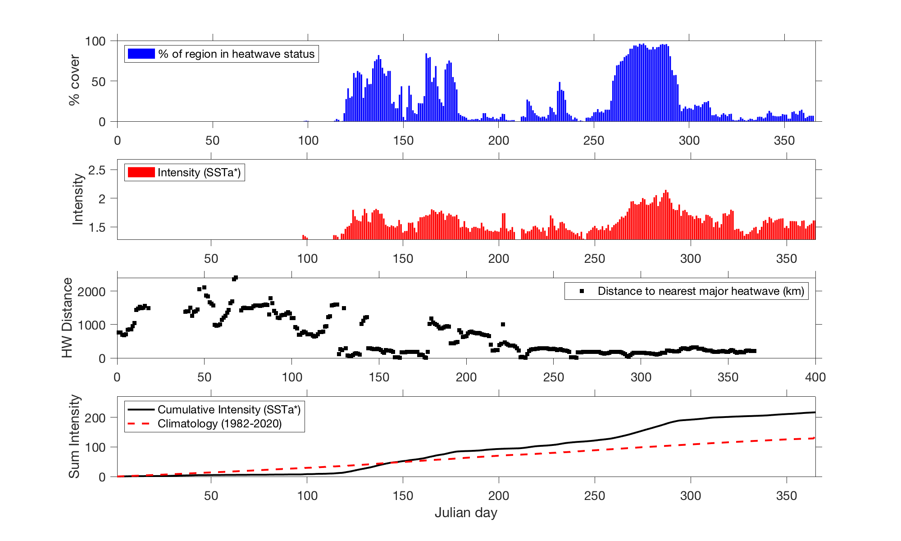
:::

::: {.icon}
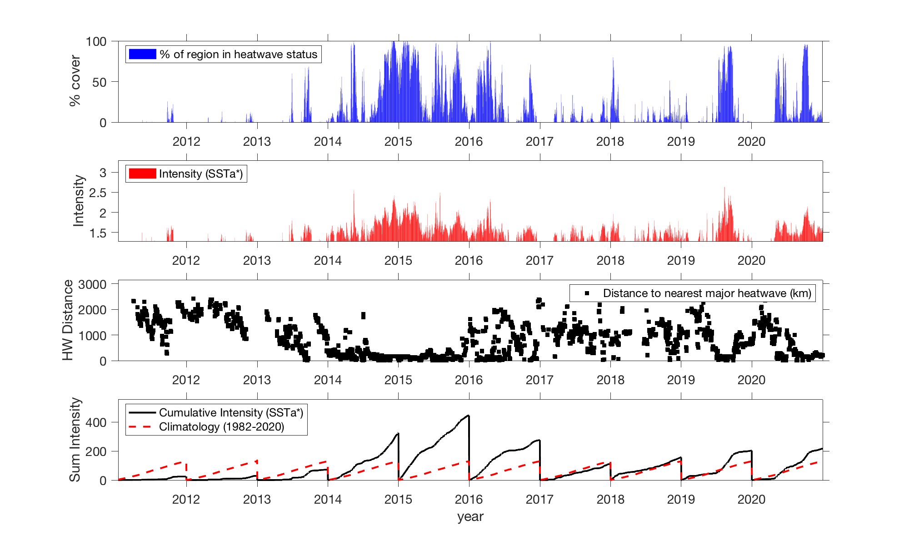
:::

## Central California

::: {.icon-tiny}
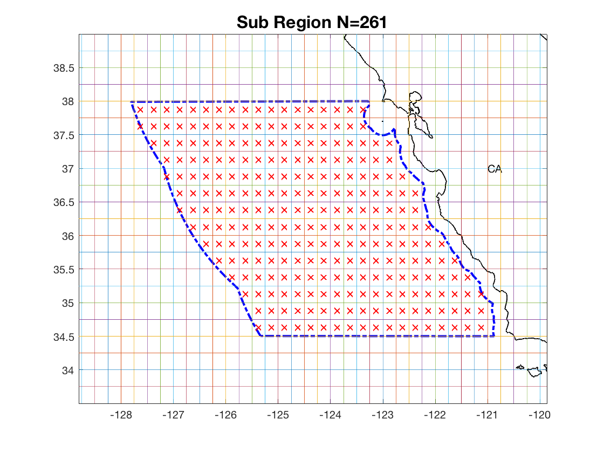
:::

[Download Central Californian daily data](https://oceanview.pfeg.noaa.gov/erddap/tabledap/cciea_OC_MHW_regions.graph?time%2Cheatwave_cover%2C&region=%22cencal%22&.draw=lines&.marker=5%7C5&.color=0x000000&.colorBar=%7C%7C%7C%7C%7C&.bgColor=0xffccccff")

::: {.icon}
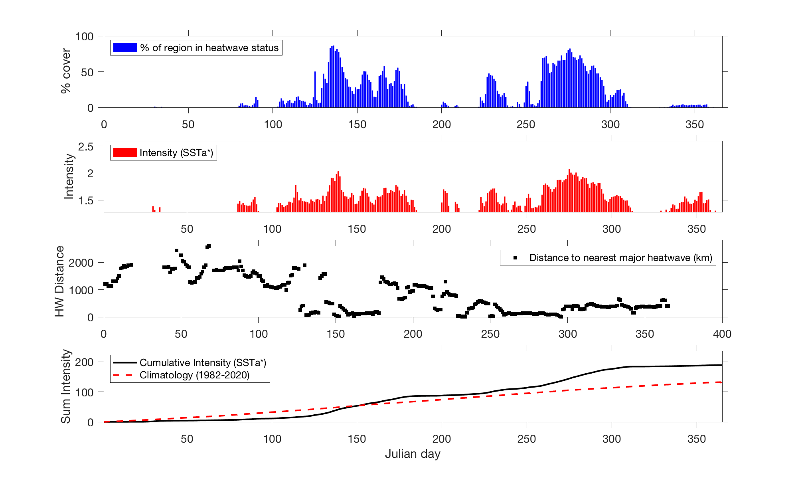
:::

::: {.icon}
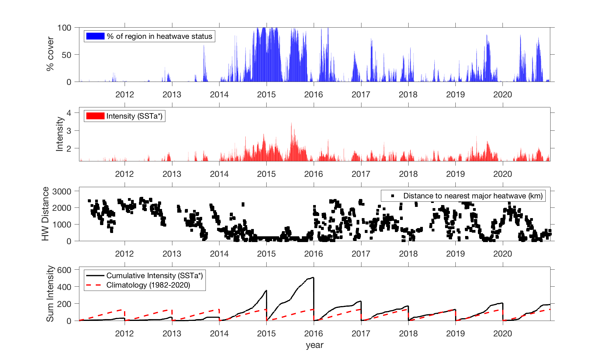
:::

## Southern California

::: {.icon-tiny}
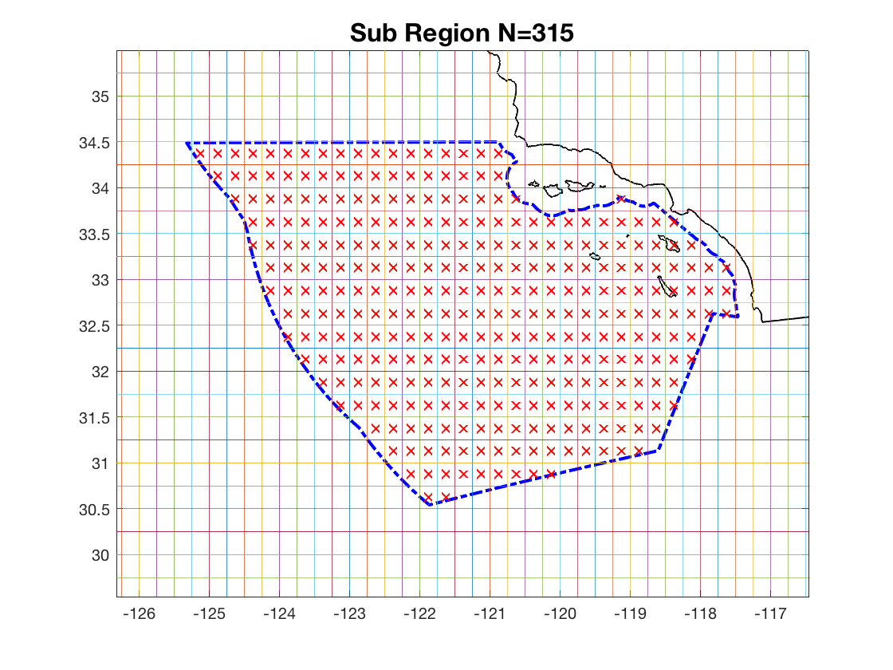{.icon-tiny}
:::

[Download Southern California daily data](https://oceanview.pfeg.noaa.gov/erddap/tabledap/cciea_OC_MHW_regions.graph?time%2Cheatwave_cover%2C&region=%22socal%22&.draw=lines&.marker=5%7C5&.color=0x000000&.colorBar=%7C%7C%7C%7C%7C&.bgColor=0xffccccff")

::: {.icon}
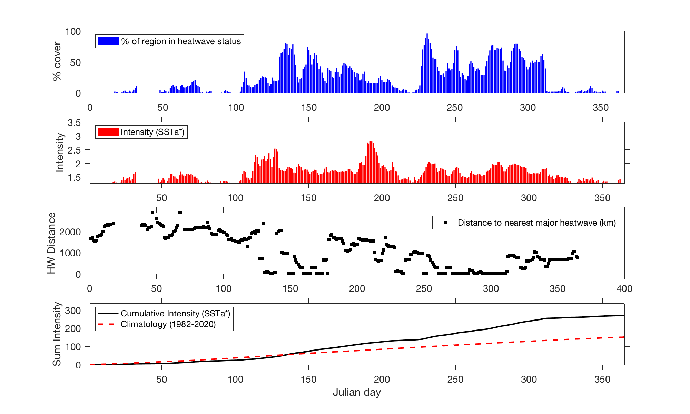
:::

::: {.icon}
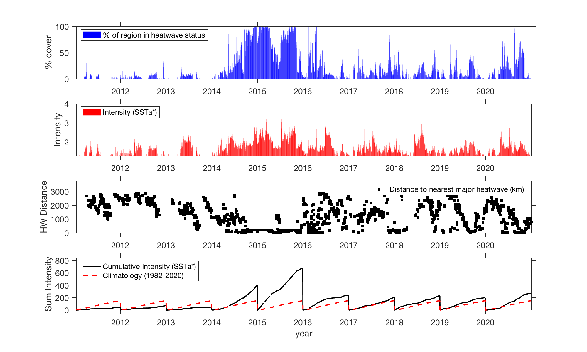
:::

