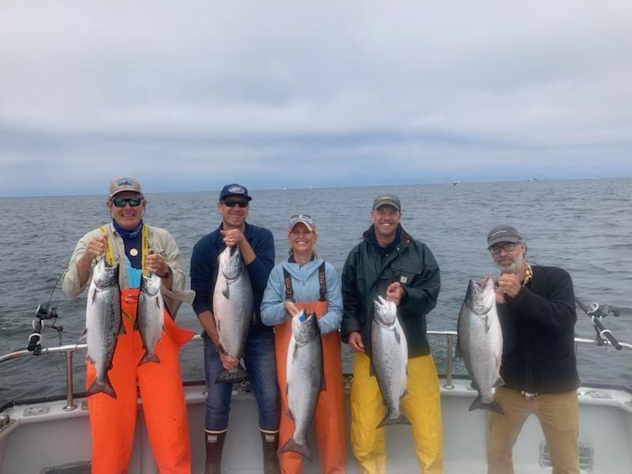
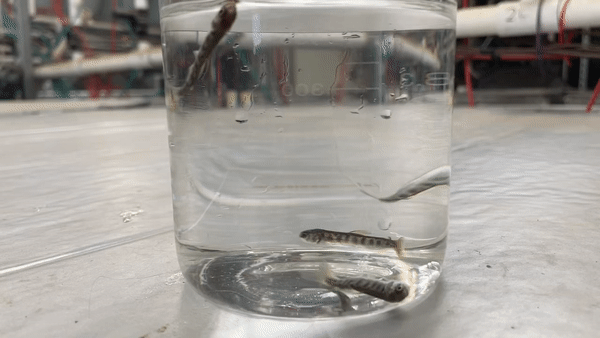

::::{style="padding-left: 15px;"}

*Jump to:*

* About
* [Ocean Fishery](ocean_fishery.qmd)
* [Central Valley Hatchery Stocks](hatchery_ccv.qmd)
* [Coastal Hatchery Stocks](hatchery_coastal.qmd)

::::

## Background

::::: {layout-ncol=2}

:::{}

Thiamine deficiency complex (TDC) was first observed in juvenile California Chinook salmon in early 2020, coinciding with changes in oceanic conditions that disrupted the marine food web. As female salmon returned to freshwater spawning grounds with low levels of this essential vitamin, they provided insufficient thiamine to their eggs, inhibiting proper development. This led to increased mortality rates among juveniles in hatcheries, with surviving fish exhibiting symptoms of TDC, such as erratic swimming and lethargy. In response, a collaborative effort involving multiple agencies began to investigate the prevalence and impacts of thiamine deficiency in California salmonids.

:::
        	

::::

## Surveillance and Assessment

::::: {layout-ncol=2}

:::{}

To assess thiamine deficiency and its effects over time, egg thiamine levels have been systematically measured at various hatcheries in central and northern California. Unfertilized eggs from mature Chinook salmon (*Oncorhynchus tshawytscha*), Steelhead trout (*Oncorhynchus mykiss*), and coho salmon (*Oncorhynchus kisutch*) were collected across California to measure thiamine concentrations. This ongoing surveillance has shown a rising incidence of TDC in nearly all populations in California&rsquo;s Central Valley and coastal hatcheries. Additionally, laboratory studies have investigated the relationship between egg thiamine concentration and offspring survival, helping to understand population-level impacts of thiamine-dependent mortalities.

:::
        	

::::

## More Information

See [SWFSC Monitoring Thiamine Deficiency in California Salmon](https://www.fisheries.noaa.gov/west-coast/science-data/monitoring-thiamine-deficiency-california-salmon) for more information

