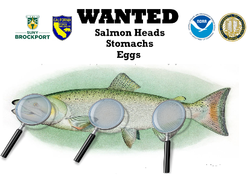

```{r}
#| echo: false
#| warning: false
#| message: false
source("read_thiamine_data.R")
```

::::{style="padding-left: 15px;"}

*Jump to:*

* [About](about.qmd)
* Ocean Fishery
* [Central Valley Hatchery Stocks](hatchery_ccv.qmd)
* [Coastal Hatchery Stocks](hatchery_coastal.qmd)

::::


## Ocean Fishery

::::: {layout-ncol=2}

:::{}

Our team works with anglers and fishing industry partners to monitor the nutritional status of Chinook salmon caught in the Central California coastal fishery. Anglers are given a card with unique fish number so that they can track the thiamine levels in the fish they catch for this study. This page enable anglers to look up the thiamine levels in the fish they catch.

[Download Wanted Poster](images/Wanted_Poster_071221_v3.pdf)

:::
        	


::::

## Ocean Fishery Thiamine Status - aggregated and by boat

```{r}
#| echo: false
#| fig-height: 5 
#| out-width: "100%"
plot_thiamine_pie(thiamine_data, div_idx = 1)
```

::: {style="background-color:lightgray; border-top:1px solid darkgray; padding-bottom:5px;"}
:::

```{r}
#| echo: false
#| fig-height: 5 
#| out-width: "100%"
# Corresponds to bardata[0] (div = 1, height = 500)
plot_thiamine_bar(thiamine_data, div_idx = 1)
```

::: {style="background-color:lightgray; padding:10px;"}
**Thiamine Levels (nmol/g)**\
[**Severely impacted:**]{style="color: `r status_colors['severely impacted']`"} < 2.9\
[**Impacted:**]{style="color: `r status_colors['impacted']`"} 3 - 5\
[**Likely impacted:**]{style="color: `r status_colors['likely impacted']`"} 5 - 8\
[**Unlikely impacted:**]{style="color: `r status_colors['unlikely impacted']`"} > 8
:::

<!--## Find your salmon!

### Choose one the following to search the database:-->

## Downloads

[Download all Ocean Fishery data as a text file](https://oceanview.pfeg.noaa.gov/erddap/tabledap/Salmon_thiamine.csv?&collection_type=%22ocean%20fishery%22&treatment_status=~%22(NA|saline)%22&avg_total_egg_thi>0)

[Customize your download in ERDDAP™](https://oceanview.pfeg.noaa.gov/erddap/tabledap/Salmon_thiamine.html)
