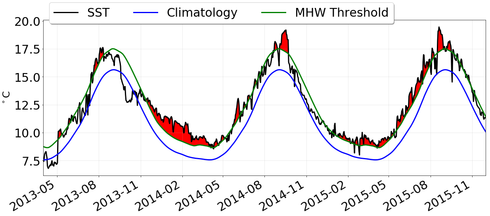
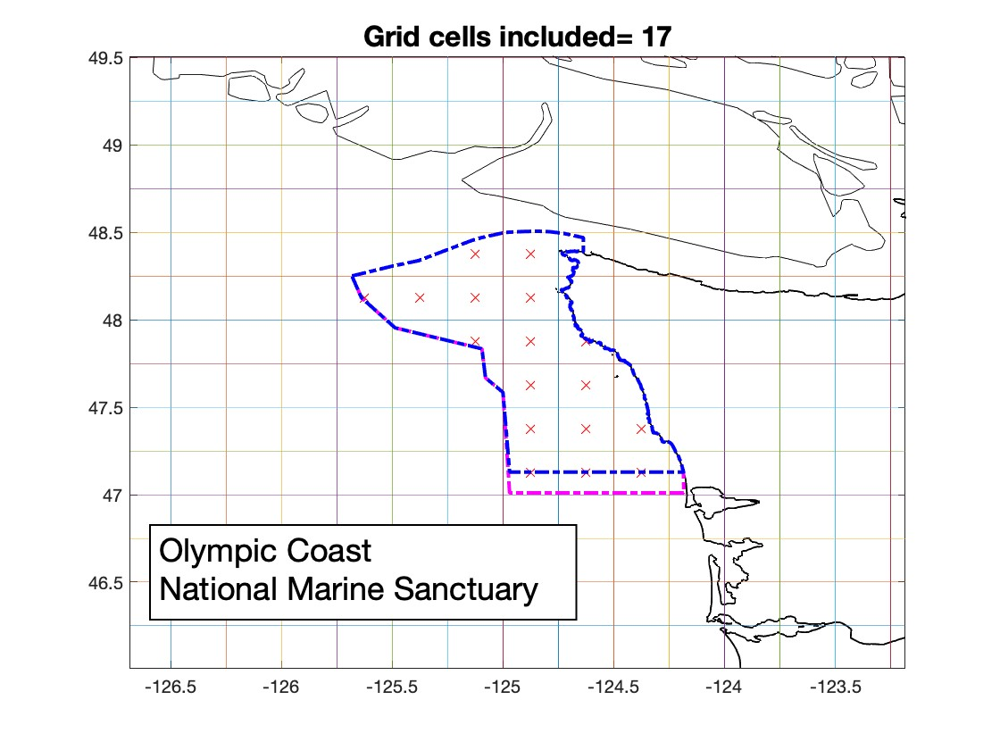
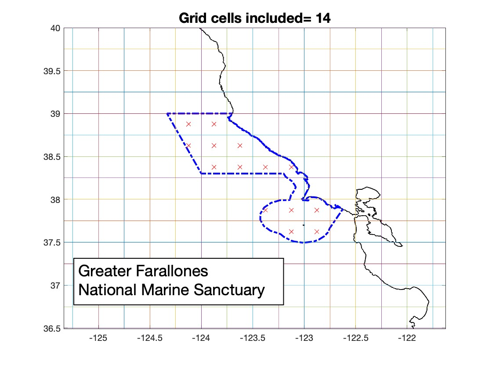
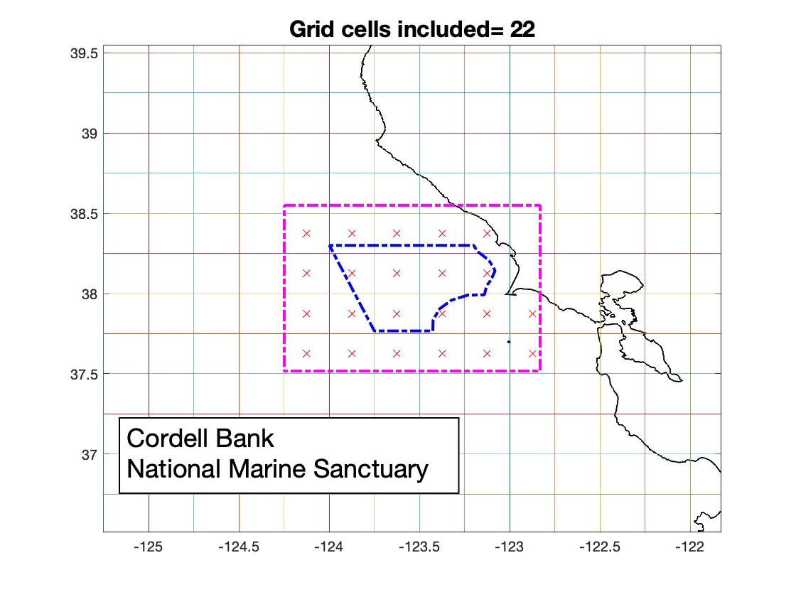
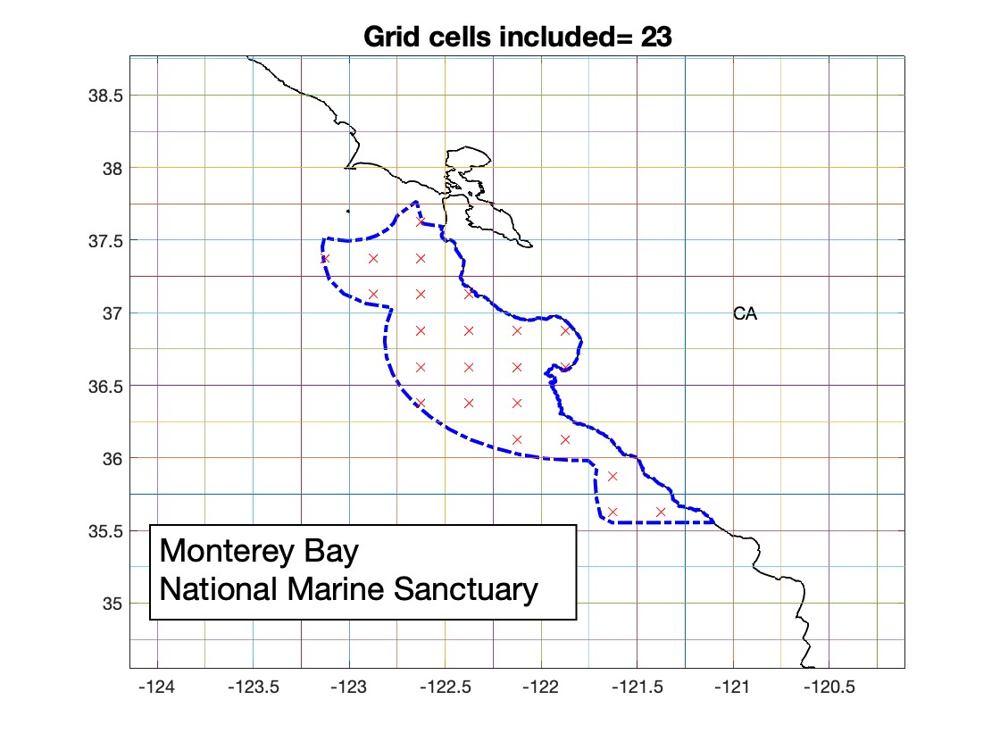
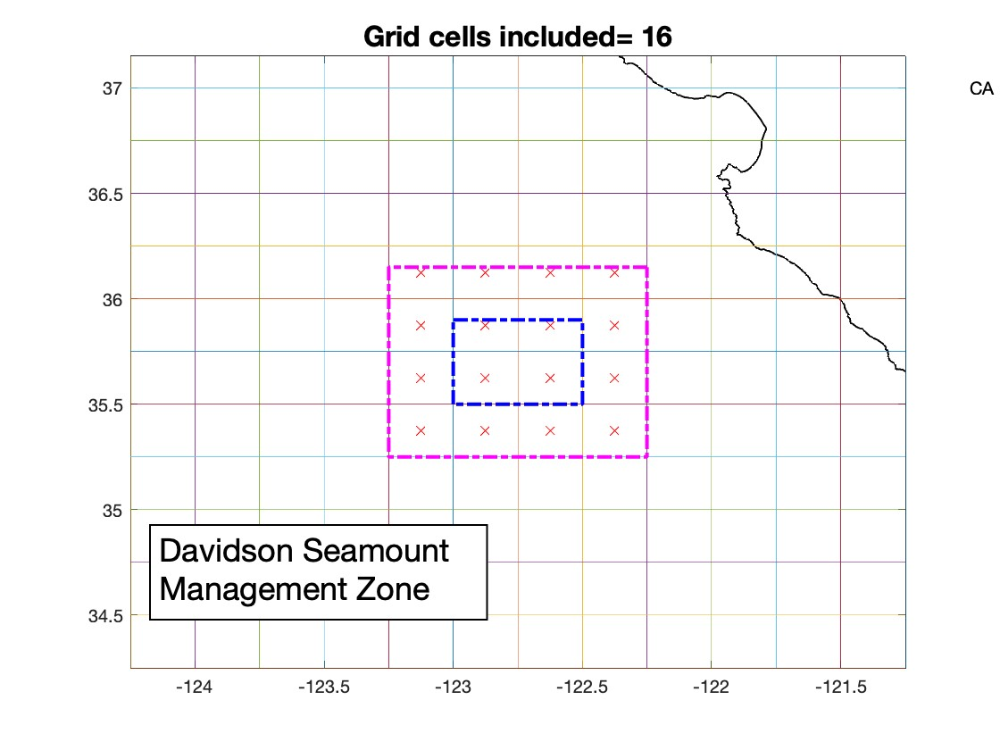
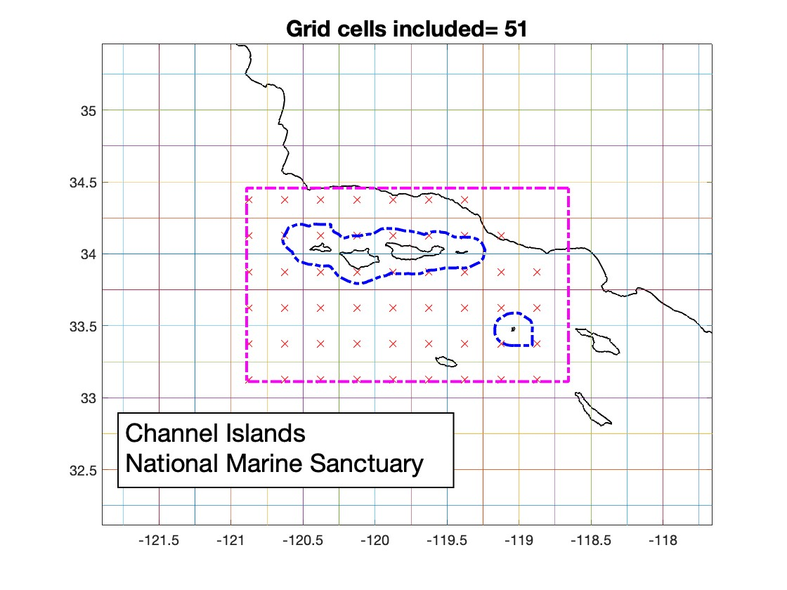

```{=html}
<style>
.custom-card-container {
  display: grid;
  /* Automatically wraps cards when the center panel gets tighter */
  grid-template-columns: repeat(auto-fit, minmax(150px, 1fr));
  gap: .1rem;
  width: 100%;
}
</style>
```


:::{#regions}
:::


## Calculating heatwaves

Marine heatwaves, or MHWs, occur when ocean temperatures are much warmer than usual for an extended period of time; they are specifically defined by differences in expected temperatures for the location and time of year as described in [Hobday et al. 2016](https://doi.org/10.1016/j.pocean.2015.12.014). Specifically Hobday et al. suggest that any particular location is experiencing a heatwave if its temperature exceeds 90% of all previously measured temperatures at that location for that day of the year, for at least 5 days in a row.

[The California Current MHW Tracker](../mhw/latest.qmd), developed by oceanographers from NOAA Fisheries’ Southwest Fisheries Science Center, modifies the Hobday et al. approach to analyze sea surface temperature (SST) data produced daily on a regular global grid at a resolution of ¼ degree. The data is from the [NOAA OISST dataset](https://www.ncdc.noaa.gov/oisst), which is mostly satellite data, with some assimilated data from buoys and ships. The Hobday et al. 2016 approach was adapted as follows:

* First a climatology was produced for each location (i.e., each ¼ degree grid cell) by calculating the average temperature observed from 1982-2024 for each day of the year [blue line]{style="color:#0000ff"}
* The actual temperature observed ([black line]{style="color:#000000"}) is compared to the climatology value for that day at that location
* The difference between the observed SST ([black line]{style="color:#000000"}) and the climatology ([blue line]{style="color:#0000ff"}) is the sea surface temperature anomaly (SSTa). Sometimes the observed SST is below the average (a cool anomaly) and sometimes it is above average (a warm anomaly)
* A heatwave ([red line]{style="color:#ff0000"}) is identified when the SSTa is above the MHW threshold ([green line]{style="color:#017901"})



The MHW threshold ([green line]{style="color:#017901"}) is calculated by first standardizing the SSTa by the standard deviation of SSTa at that location for each day of the year, resulting in a new metric SSTa\*. Any particular location is then considered in "heatwave status" if its value of SSTa\* is > 1.29 (this threshold "intensity" is the exact parametric equivalent to the 90% threshold suggested by Hobday et al. 2016). Lastly, individual heatwave "events" are tracked over time by grouping together all contiguous locations exceeding the MHW threshold, noting the size of the area and the spatially-averaged intensity.

## Tracking heatwaves in West Coast Region National Marine Sanctuaries

Staff from National Marine Sanctuaries in the West Coast Region partnered with the California Current MHW Tracker team to apply this approach for each of six west coast national marine sanctuary areas (see maps below and on the [overview page](overview.qmd)). For larger sanctuaries, we use the sanctuary boundary (blue dashed line) to determine which grid cells (marked with red X) to include in calculations. For smaller sanctuaries, a pink dashed line indicates grid cells from the surrounding areas added into the calculations.

::: {layout-ncol="2"}













:::

For each sanctuary area, the same set of calculations are run weekly and the resulting maps and graphs can be viewed on their respective MHW tracker web pages: [Olympic Coast](OCNMS.qmd){fig-align="Jump tp Olympic Coast page"}, [Greater Farallones](GFNMS.qmd){fig-align="Jump to Greater Farallones page"}, [Cordell Bank](CBNMS.qmd){fig-align="Jump tp Cordell Bank page"}, [Monterey Bay - Mainland](MBNMS.qmd){fig-align="Jump tp Monterey Bay - Mainland page"}, [Monterey Bay - Davidson Seamoun](DSNMS.qmd){fig-align="Jump tp Monterey Bay - Davidson Seamoun page"}, and [Channel Islands](CINMS.qmd){fig-align="Jump tp Channel Islands page"}. Below we describe how each type of map and graph on a sanctuary MHW tracker page is calculated. Requests for additional information should be directed to the West Coast Sanctuaries MHW Tracker project leads.

Project leads:<br>West Coast Sanctuaries MHW Tracker: Jennifer.Brown@noaa.gov (NOAA-ONMS-MBNMS & CINMS)<br>California Current MHW Tracker: Andrew Leising, Lynn deWitt (NOAA-NMFS-SWFSC); Greg Williams (NOAA-NMFS-NWFSC)

## How was each figure calculated?

### Have West Coast Sanctuaries experienced marine heatwaves recently?

**Map of daily temperature anomaly** = This map shows the Sea Surface Temperature anomaly (SSTa) for each grid cell on the most recent day that calculations were run (date provided above the map). SSTa, or the amount that day’s observed SST differed from average (based on the climatology for that grid cell), is shown using shades of red for warm anomalies and shades of blue for cool anomalies. The brighter the color, the greater the SSTa differed from the average. Bright red areas surrounded by a solid black line denote areas in which SSTa exceeded the MHW threshold that day. See the ‘Calculating Heatwaves’ section above for more details on how the climatology and SSTa were calculated.

### Where have heatwaves occurred most often so far this year

**Map of days in heatwave status** =  this map uses color to show the total number of days so far this year that each grid cell's daily SSTa exceeded the MHW threshold.  The date of the most recent calculation is shown at the top of the map. Cooler colors show grid cells with fewer days in heatwave status while warmer colors show cells with more days in heatwave status. The warmest red is used for cells that have experienced 180 or more days in heatwave status.

### When and where did we see heatwaves during year

**Movie of daily temperature anomaly** =  Play the movie to view the daily temperature anomaly maps for every day of the year. The movie can be paused at any time. Movies for past years are available for download in the video library.

### How strong were heatwaves in the sanctuary region

**Daily Regional Difference from Average** = On each day, the sea surface temperature anomaly (SSTa) is averaged spatially across all grid cells within the designated region (dashed lines on the maps) and shown as red bars when this spatial average is higher than zero, and blue bars when the average is lower than zero.  Thus the “difference from average” is the difference on a particular day of this spatial average from the long-term spatial average for that day of the year, calculated from climatology. Similarly, the gray shaded area represents the ± 1 standard deviation of the climatological average for the designated region on each day of the year, and is thus the "expected" range of variation from average. The dashed black line denotes the marine heatwave threshold and red bars above the dashed black line are days when anomalous heat in the sanctuary region exceeded the region’s heatwave threshold.

### How large were heatwaves in the sanctuary region

**Daily % Heatwave Cover** = a black bar shows the percent of the grid cells within the sanctuary region (shown as dashed lines on the maps) that are in heatwave status that day (based on the climatology for each grid cell). Thus this indicator tells you how much of the sanctuary region was considered to be in a heatwave each day of the year for the last 10 years.

### Is more heat accumulating in the sanctuary compared to a typical year

**Annual Cumulative Heat** = each day, for grid cells within the sanctuary region (dashed lines on the map) with a sea surface temperature anomaly (SSTa) greater than zero, the positive heat values are summed and then divided by the total number of grid cells in the region. This daily, spatially-averaged anomalous heat value is summed over time to calculate the observed cumulative heat (solid red line) which is compared to an average cumulative heat calclated using all years from 1982-2020 (climatology, dotted black line). The cumulative heat calculations reset to zero each year on January 1. This indicator tells you just how much "hotter" or "colder" than normal the temperatures were on average across the sanctuary region and how much total anomalous heat a sanctuay has been exposed to during the course of a year.

### Where did heatwaves occur in the last 12 years

Each map, in this series of 12 maps, uses color to show the total number of days that year that a grid cell’s daily SSTa exceeded the MHW threshold. Cooler colors show grid cells with fewer days in heatwave status while warmer colors show cells with more days in heatwave status. The warmest red is used for cells that have experienced 180 or more days in heatwave status.

### When and how often did heatwaves occur in the past 20 years

**Heatwave occurrence vs day of year** = on each day of the year, if one or more grid cells within the sanctuary region (dashed lines on the map) was in heatwave status, then a red square is added to the graph on that day. The total number of heatwave days (red squares) in a year is noted in the far right column. For the current year, the total days are cumulative up to the most recent day, and the most recent day is shown by a black dot. This graph is updated weekly. This indicator provides information on what time of year a sanctuary region typically is influenced by heatwaves, and is a way to compare this across years.

### Were heatwaves larger recently than in the past

**Average % heatwave cover by year** = the daily percent of the grid cells within the sanctuary region (shown as dashed lines on the maps) that are in heatwave status are averaged for each calendar year starting in 1982. The vertical bars show the standard deviation, or variability, of the daily values in a given year.

### Were heatwaves stronger recently than in the past

**Average heatwave intensity by year** = the daily heatwave intensity within the sanctuary region (heatwave intensity is the spatially-average normalized SSTa value for all grid cells with an anomaly greater than the heatwave threshold) is averaged over each calendar year starting in 1982. The vertical bars show the standard deviation, or variability, of the daily values in a given year.

### Have marine heatwaves occurred recently in the Sanctuary

**Heatwave occurrence vs day of year** = on each day of the year for a particular year, if one or more grid cells within a sanctuary area was in heatwave status, then a red square is added to the graph for that sanctuary area on that day. The total number of heatwave days (red squares) in that year is noted in the far right column. For the current year, this graph is updated weekly, the total days is cumulative up to the most recent day, and the most recent day is shown by a black dot. This indicator provides information on when a sanctuary area was influenced by heatwaves recently, and is a way to compare this across sanctuary areas.
