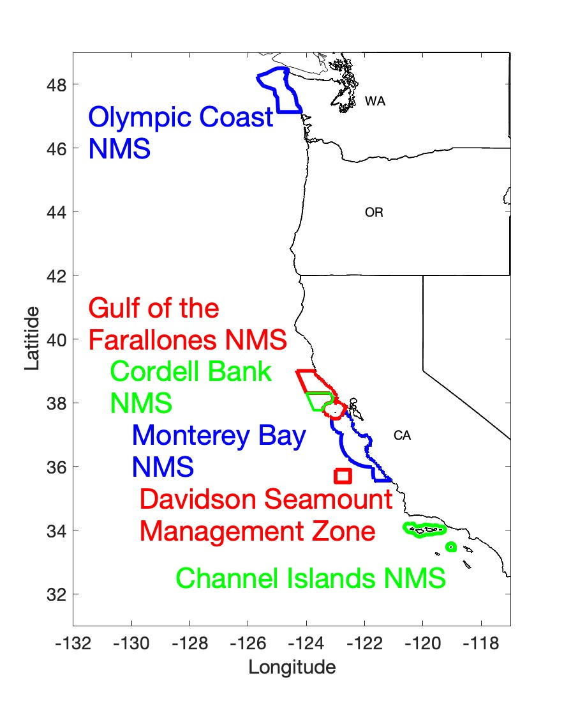

```{=html}
<style>
.custom-card-container {
  display: grid;
  /* Automatically wraps cards when the center panel gets tighter */
  grid-template-columns: repeat(auto-fit, minmax(150px, 1fr));
  gap: .1rem;
  width: 100%;
}
</style>
```


:::{#regions}
:::


## What is a marine heatwave (MHW)?

::: {.details}
<p>In the last decade, incidents of unusually high ocean temperatures have occurred off the west coast of the United States, commonly referred to as marine heatwaves, or MHWs. A marine heatwaves is specifically defined by how different the observed temperature is from what is typical for a certain location at a specific time of year. Although marine heatwaves can occur at any water depth, one of the most common ways that scientists measure the ocean’s temperature, and study marine heatwaves, is at the <a href='https://oceanservice.noaa.gov/facts/sea-surface-temperature.html' target='_blank' alt='definition of sea surface'>sea surface</a>.</p><p>The maps above show whether the sea surface was recently observed to be warmer (red) or cooler (blue) than it typically is for that time of year in and around each of the west coast national marine sanctuaries (boundaries shown in dark blue). If an area is a warm color and surrounded by a solid black line, then that area was identified as a heatwave event. These maps are updated periodically, with the last update occurring on month/day/year.</p><p>You can explore more information about the timing, size and intensity of recent marine heatwaves in each of the west coast sanctuaries, as well as compare recent patterns to those observed over the last four decades, by clicking on the sanctuary names and maps above. Learn how we identify marine heatwaves and make various calculations on the <a href="javascript:void(0)" onclick="javascript:window.location.assign(window.location.pathname.replace('overview','how'));" title="Jump to MHW Calculations section" alt="Jump to MHW Calculations section">MHW Calculations</a> page</p>
:::

## Have West Coast Sanctuaries experienced marine heatwaves recently?

::: {.icon}
{style="max-width:54vw }
:::

:::{.icon}

![The timing and length of marine heatwave events in west coast sanctuaries is shown for the most recent 365 days. Each day that a portion of the sanctuary was experiencing a marine heatwave is shown as a red dot. The total number of heatwave days each year is noted in the far right column. How often and how long MHWs were present was quite variable over the last year. Each day that a sanctuary was classified as in 'heatwave' status over the past year is shown for each sanctuary with the total number of days noted on the far right column. Click here to see how this graph was calculated](images/All_regions_heatwave_days_22-23vert.png){style="width:1200px }

:::
