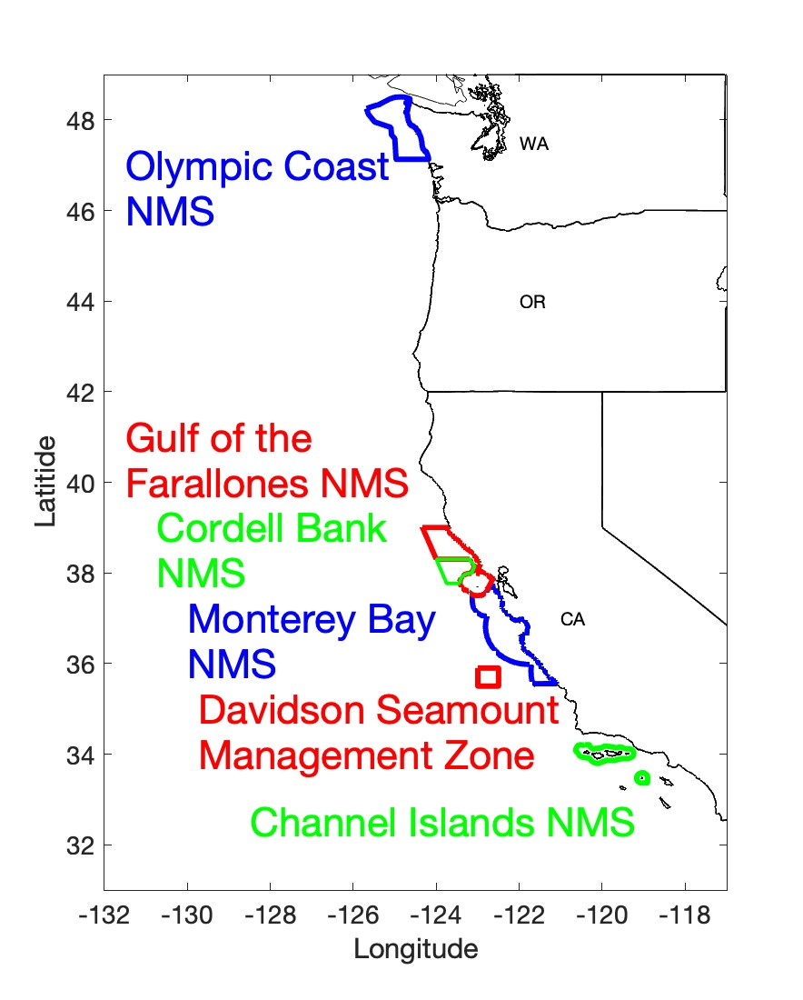
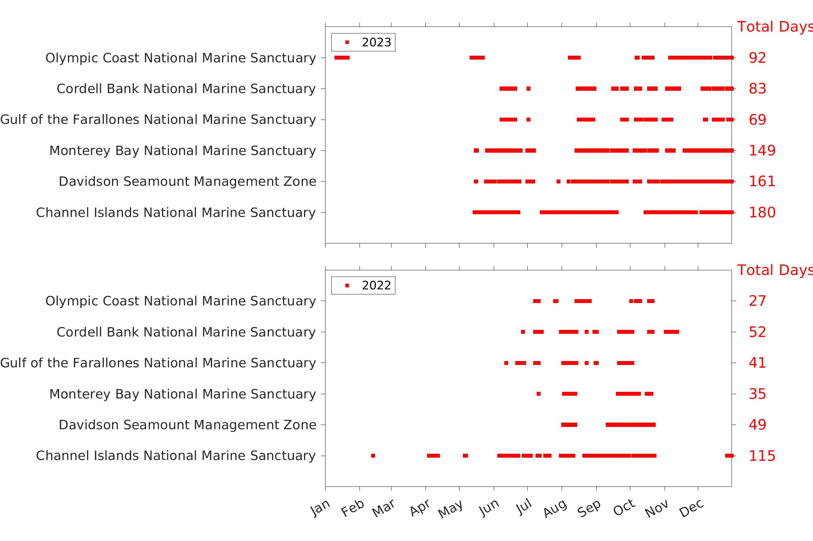

```{=html}
<style>
.custom-card-container {
  display: grid;
  /* Automatically wraps cards when the center panel gets tighter */
  grid-template-columns: repeat(auto-fit, minmax(150px, 1fr));
  gap: .1rem;
  width: 100%;
}
</style>
```


:::{#regions}
:::


## What is a marine heatwave (MHW)?

In the last decade, incidents of unusually high ocean temperatures have occurred off the west coast of the United States, commonly referred to as marine heatwaves, or MHWs. A marine heatwaves is specifically defined by how different the observed temperature is from what is typical for a certain location at a specific time of year. Although marine heatwaves can occur at any water depth, one of the most common ways that scientists measure the ocean’s temperature, and study marine heatwaves, is at the <a href='https://oceanservice.noaa.gov/facts/sea-surface-temperature.html' target='_blank' alt='definition of sea surface'>sea surface</a>.</p><p>The maps above show whether the sea surface was recently observed to be warmer (red) or cooler (blue) than it typically is for that time of year in and around each of the west coast national marine sanctuaries (boundaries shown in dark blue). If an area is a warm color and surrounded by a solid black line, then that area was identified as a heatwave event. These maps are updated periodically, with the last update occurring on month/day/year.</p><p>You can explore more information about the timing, size and intensity of recent marine heatwaves in each of the west coast sanctuaries, as well as compare recent patterns to those observed over the last four decades, by clicking on the sanctuary names and maps above. Learn how we identify marine heatwaves and make various calculations on the <a href="javascript:void(0)" onclick="javascript:window.location.assign(window.location.pathname.replace('overview','how'));" title="Jump to MHW Calculations section" alt="Jump to MHW Calculations section">MHW Calculations</a> page

## Have West Coast Sanctuaries experienced marine heatwaves recently?

::: {layout="[[27,73],[100]]"}
{style="width:100%"}

{style="width:100%"}

::: {.details}
The timing and length of marine heatwave events in west coast sanctuaries is shown for the current and previous year. Each day that any portion of the sanctuary was experiencing a marine heatwave is shown as a red dot. The total number of heatwave days each year is noted in the far right column. For the current year, this information is updated weekly and the black line shows the most recent day.
:::

::: {.callout-note title="How was this information calculated?" collapse="true"}

**Heatwave occurrence vs day of year** = on each day of the year for a particular year, if one or more grid cells within a sanctuary area was in heatwave status, then a red square is added to the graph for that sanctuary area on that day. The total number of heatwave days (red squares) in that year is noted in the far right column. For the current year, this graph is updated weekly, the total days is cumulative up to the most recent day, and the most recent day is shown by a black dot. This indicator provides information on when a sanctuary area was influenced by heatwaves recently, and is a way to compare this across sanctuary areas.

see the MHW Calculations page for more information
:::

:::

## Why do we care about marine heatwaves?

::: {.details}
Scientists are still assessing the influence of marine heatwaves on ocean ecosystems and coastal communities. During past marine heatwaves, some large fish, such as sharks and swordfish, have been observed traveling further north as their warm water habitat expands. The abundance of prey species, such as anchovy and sardine, can change dramatically and influence conditions for their predators, including sea lions, seabirds, whales, as well as fishing activities. Marine heatwaves have been linked to dramatic declines in large kelp and associated kelp forest species in areas along the California coast. Tracking the size, duration and intensity of marine heatwaves in sanctuaries can help us to better characterize these important events and to understand their impacts on sanctuary ecosystems and coastal communities.
:::

