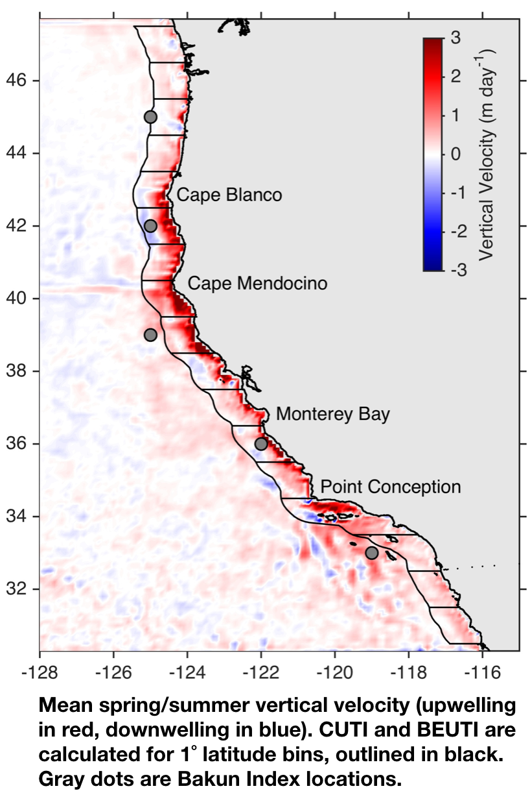
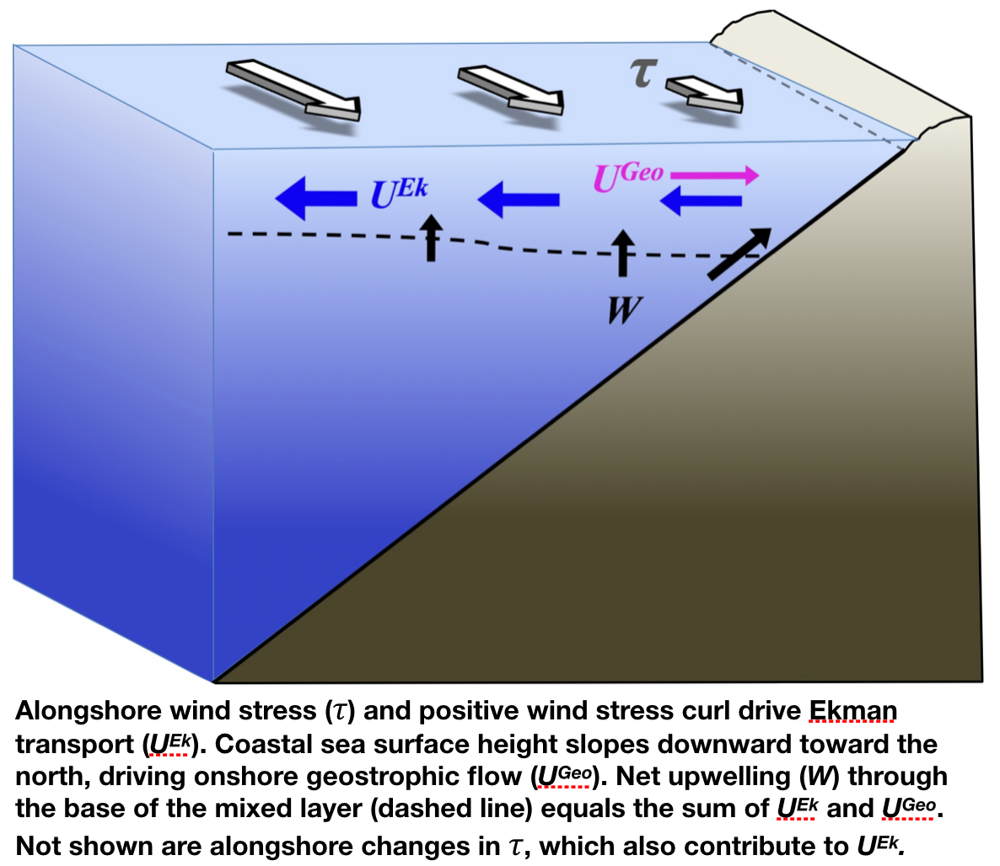
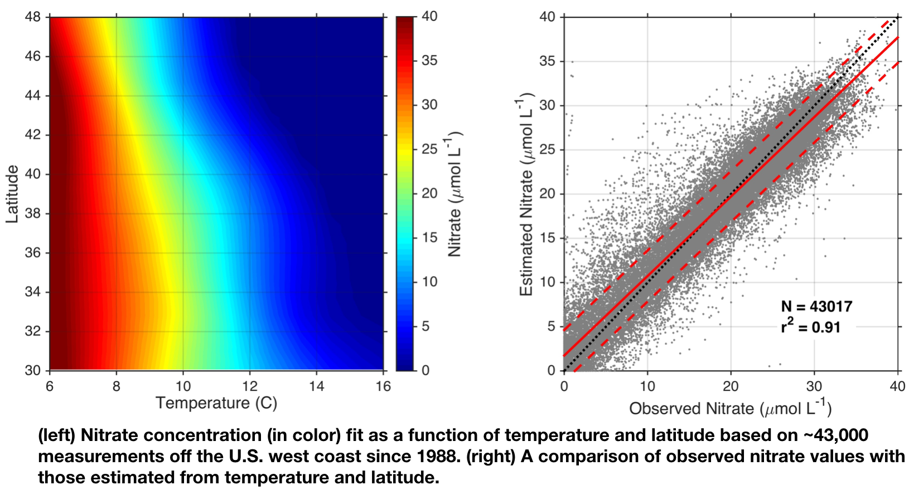

## New West Coast Indices

::::: {layout-ncol=2}

::: {}

The **Coastal Upwelling Transport Index** (**CUTI**, pronounced "cutie") and the **Biologically Effective Upwelling Transport Index** (**BEUTI**; pronounced "beauty") are two new upwelling indices that leverage state-of-the-art ocean models as well as satellite and *in situ* data to improve upon historically available upwelling indices for the U.S. west coast (@jacox18).

**CUTI** provides estimates of vertical transport near the coast (i.e., upwelling/downwelling). It was developed as a more accurate alternative to the previously available ‘Bakun Index’ (@bakun73, @bakun75, @schwing96).

[Explore CUTI&#x2197;](https://oceanview.pfeg.noaa.gov/erddap/search/index.html?searchFor=erdCUTI)

**BEUTI** provides estimates of vertical nitrate flux near the coast (i.e., the amount of nitrate upwelled/downwelled), which may be more relevant than upwelling strength when considering some biological responses.

[Explore BEUTI&#x2197;](https://oceanview.pfeg.noaa.gov/erddap/search/index.html?searchFor=erdBEUTI)

:::

:::::

*CUTI and BEUTI were developed in the Environmental Research Division of NOAA’s <a href="https://swfsc.noaa.gov/" target="_blank">Southwest Fisheries Science Center</a>, in collaboration with the <a href="http://oceanmodeling.ucsc.edu/" target="_blank">UC Santa Cruz Ocean Modeling Group</a>.*

## How is CUTI calculated?

::::: {layout-ncol=2}

::: {}

**CUTI** is an estimate of vertical transport into (or out of) the surface mixed layer. It is calculated from surface wind stress, sea surface height, and mixed layer depth, each derived from a <a href='http://oceanmodeling.ucsc.edu/' target='_blank' style='text-decoration:none;'>regional ocean reanalysis</a> (i.e., an ocean model that assimilates available data from satellites and in situ platforms).

CUTI estimates total vertical transport through the base of the mixed layer (***W***) as the sum of two components:

1. Vertical transport due to divergence or convergence in near-surface Ekman transport (***U^Ek^***), which is driven by alongshore winds as well as wind stress curl.

2. Vertical transport associated with cross-shore geostrophic transport (***U^Geo^***), associated with an alongshore pressure gradient.

:::

:::::

Briefly, ***U^Ek^*** is estimated by calculating Ekman transport as a function of wind stress and integrating it along the northern, western, and southern boundaries of each 1&deg; latitude bin. Cross-shore geostrophic velocity is calculated from the mean alongshore sea surface height gradient in each 1&deg; latitude bin, and that velocity is integrated over the mixed layer depth to estimate ***U^Geo^***. Then, **CUTI** = ***U^Ek^*** + ***U^Geo^***

## How is BEUTI calculated?

::::: {layout-nrow=2}

::: {}

**BEUTI** is an estimate of nitrate flux into (or out of) the surface mixed layer. It is obtained by multiplying vertical transport at the base of the mixed layer by nitrate concentration at the base of the mixed layer: **BEUTI** = **CUTI** * **[NO~3~^–^]~MLD~**.

CUTI is calculated as described above, and nitrate concentration at the base of the mixed layer is estimated from the ocean reanalysis by using temperature at the base of the mixed layer and latitude as input to a temperature-latitude-nitrate relationship (left panel). This relationship was developed based on over 43,000 nitrate measurements from multiple observational programs along the U.S. west coast, and it is very effective for estimating nitrate (below).

:::

:::::

## References

::: {#refs}
:::
