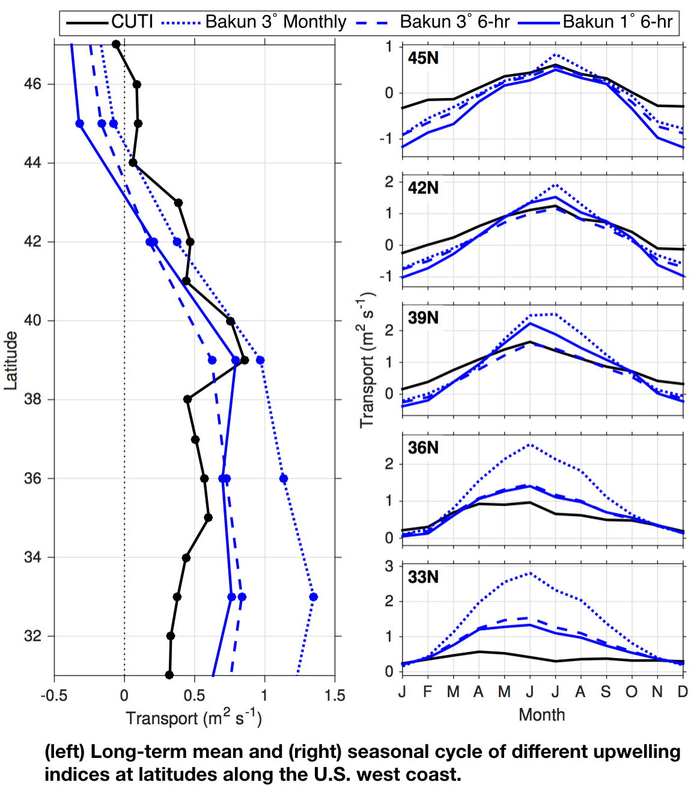

## How are CUTI and BEUTI different from the Bakun Index?

Details of the CUTI and BEUTI calculations and a thorough comparison with the [Bakun Index](bakun.qmd) are in @jacox18. Here we briefly review key differences between indices.

1. The Bakun Index uses sea level pressure fields from an atmospheric reanalysis to derive estimated near-surface winds, while CUTI and BEUTI use winds directly from atmospheric reanalyses that assimilate satellite and in situ wind measurements.

2. CUTI and BEUTI fully account for upwelling driven by wind stress curl, while the Bakun Index does not. Specifically, it omits upwelling associated with alongshore changes in the wind.

3. CUTI and BEUTI account for cross-shore geostrophic transport, which can suppress or enhance upwelling relative to the wind-driven Ekman transport, while the Bakun Index does not.

4. BEUTI estimates not just the volume transport of upwelling/downwelling, but also the amount of nitrate being upwelled/downwelled. Neither CUTI nor the Bakun Index consider the properties of upwelled water.

::::: {layout-ncol=2}

::: {}

Differences between CUTI and the Bakun Index are clearly visible in their long-term means and seasonal cycles at latitudes spanning the U.S. west coast (see figure at right). Note that several versions of the Bakun Index have been created throughout the years, as there have been periodic changes to the sea level pressure fields used to generate them. They are referred to here as 3&deg; monthly, 3&deg; 6-hourly, and 1&deg; 6-hourly, after the spatial and temporal resolutions of the sea level pressure fields used to derive them.

:::

:::::

Differences in mean transport estimates are especially pronounced off southern and central California, where @bakun73 pointed out that limitations of using relatively coarse-resolution sea level pressure fields to estimates near-surface winds. In the seasonal cycle, the Bakun Index tends to give much higher estimates of transport magnitude, particularly for winter downwelling in the north and summer upwelling in the south. This is in part because it does not account for cross-shore geostrophic transport, which tends to oppose Ekman transport and reduce the upwelling/downwelling magnitude.

Note that while points (1)-(4) above relate to simplifications in the Bakun Index that have been addressed by CUTI and/or BEUTI, the advantage to those simplifications is that they allow relatively straightforward calculation of the Bakun Index extending further back in time and over a broader spatial domain. The next section on this page provides suggestions for which index to use depending on the constraints of the problem being addressed.

## References

::: {#refs}
:::

