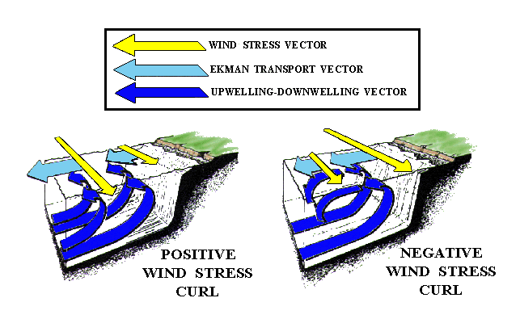

## Traditional Bakun calculation at 15 positions along the west coast of North America

### Upwelling Indices

#### Six-Hourly Upwelling Indices (1967-present)

[Header Information Readme file](https://oceanwatch.pfeg.noaa.gov/products/PFELData/upwell/6_hourly/readme.upwell_6hr)

::::: {layout-ncol=2}

::: {}

```{ojs}
//| echo: false

uilocations=[{lat:60,lon:149},{lat:60,lon:146},{lat:57,lon:137},{lat:54,lon:134},{lat:51,lon:131},{lat:48,lon:125},{lat:45,lon:125},{lat:42,lon:125},{lat:39,lon:125},{lat:36,lon:122},{lat:33,lon:119},{lat:30,lon:119},{lat:27,lon:116},{lat:24,lon:113},{lat:21,lon:107}]
products=[{name:"upwell_",title:"Upwelling Index"},{name:"wind_",title:"Geostrophic Wind"},{name:"stress_",title:"Wind Stress"},{name:"slp_",title:"Sea Level Pressure"}]

dropdownMap = new Map(uilocations.map(loc => {
  const label = `${loc.lat}N ${loc.lon}W`;
  const fileName = `upwell${loc.lat}N${loc.lon}W`;
  return [label, fileName];
}))

// Render the dropdown menu
viewof selectedFile = Inputs.select(dropdownMap, { label: "Location:" , width:140 })
```

```{ojs}
//| echo: false
// 4. Construct the final download URL
baseUrl = "https://oceanwatch.pfeg.noaa.gov/products/PFELData/upwell/6_hourly/"
downloadUrl = baseUrl + selectedFile

currentLabel = [...dropdownMap.entries()].find(([label, file]) => file === selectedFile)[0]

```

:::

::: {}

```{ojs}
//| echo: false
// 5. Render the HTML download link
html`<a href="${downloadUrl}" class="btn btn-primary"  target="_blank">
  Download
</a><br>6-hourly upwelling index at ${currentLabel}`
```

:::

:::::

#### Daily Upwelling Indices (1967-present)

::::: {layout-ncol=2}

::: {}

```{ojs}
//| echo: false

viewof selectedIndex = Inputs.select(
  uilocations.map((loc, idx) => idx), 
  {
    label: "Location:",
    width:140,
    format: idx => `${uilocations[idx].lat}N ${uilocations[idx].lon}W`
  }
)
```

```{ojs}
//| echo: false

// 3. Ultra-safe lookup logic (guards against initialization crashes)
chosenLoc = uilocations[selectedIndex] || uilocations[0];
currentLabel2 = `${chosenLoc.lat}N ${chosenLoc.lon}W`;

// 4. File and URL layout
indx = Number(`${selectedIndex ?? 0}`)+1;
indx00 = String(indx).padStart(2, '0'); 
fileName2 = "p" + indx00 + "dayac.all"
baseUrl2 = "https://oceanwatch.pfeg.noaa.gov/products/PFELData/upwell/daily/"
downloadUrl2 = baseUrl2 + fileName2
```

:::

::: {}

```{ojs}
//| echo: false

html`<a href="${downloadUrl2}" target="_blank" class="btn btn-primary">
  Download</a><br>Selected: Daily Upwelling index at ${currentLabel2}`
```
:::

:::::


#### Monthly Upwelling Indices and Anomalies (1946-present)

[Upwelling Index For All 15 Positions](https://oceanwatch.pfeg.noaa.gov/products/PFELData/upwell/monthly/upindex.mon)\
[Anomalies For All 15 Positions](https://oceanwatch.pfeg.noaa.gov/products/PFELData/upwell/monthly/upanoms.mon)
```{ojs}
//| echo: false
function getfiledate(d) {
    var y = String(d.getFullYear()).padStart(4, '0');
    var m = String(d.getMonth() + 1).padStart(2, '0'); 
    return y.substr(2) + m;
}

// Correct OJS block statement syntax
links = {
    let d = new Date();
    d.setDate(1); 
    d.setDate(0); 
    const thisyrmon = getfiledate(d);
    const thisyrmondate = (d.getMonth() + 1) + "/" + d.getFullYear();

    let d1 = new Date();
    d1.setDate(1); 
    d1.setMonth(d1.getMonth() - 1); 
    d1.setDate(0); 
    const lastyrmon = getfiledate(d1);
    const lastyrmondate = (d1.getMonth() + 1) + "/" + d1.getFullYear();

    return { thisyrmon, thisyrmondate, lastyrmon, lastyrmondate };
}

html`
<a href="https://oceanwatch.pfeg.noaa.gov/products/PFELData/upwell/monthly/table.${links.thisyrmon}" target="_blank">Most recent month (${links.thisyrmondate})</a><br>
<a href="https://oceanwatch.pfeg.noaa.gov/products/PFELData/upwell/monthly/table.${links.lastyrmon}" target="_blank">Previous recent month (${links.lastyrmondate})</a>`
```


## Derived Winds and Ocean Transports

The files available in the menus below each contain:

- surface atmospheric pressure-
- northward component of surface wind-
- eastward component of surface wind-
- northward wind stress-
- eastward wind stress-
- wind stress curl-
- cube of wind speed-
- northward component of Ekman transport-
- eastward component of Ekman transport-
- offshore component of Ekman transport-
- direction of offshore component of Ekman transport-
- vertical velocity into the Ekman layer
- Sverdrup transport





#### Six-Hourly Derived Winds and Ocean Transports (1967-1999)

::::: {layout-ncol=2}

::: {}

```{ojs}
//| echo: false

dropdownMap3 = new Map(uilocations.map(loc => {
  const label = `${loc.lat}N ${loc.lon}W`;
  const fileName = `${loc.lat}n${loc.lon}w_67to99.amk`;
  return [label, fileName];
}))

// Render the dropdown menu
viewof selectedFile3 = Inputs.select(dropdownMap3, { label: "Location:" , width:140 })
```

```{ojs}
//| echo: false
// 4. Construct the final download URL
baseUrl3 = "https://oceanwatch.pfeg.noaa.gov/products/PFELData/arrowmark_indices/"
downloadUrl3 = baseUrl3 + selectedFile3

currentLabel3 = [...dropdownMap3.entries()].find(([label, file]) => file === selectedFile3)[0]

```

:::

::: {}

```{ojs}
//| echo: false
// 5. Render the HTML download link
html`<a href="${downloadUrl3}" class="btn btn-primary" target="_blank">
  Download
</a><br>6-hourly derived winds and ocean transports at ${currentLabel3}`
```

:::

:::::

#### Six-Hourly Derived Winds and Ocean Transports (January 2000-present)

::::: {layout-ncol=2}

::: {}

```{ojs}
//| echo: false

dropdownMap4 = new Map(uilocations.map(loc => {
  const label = `${loc.lat}N ${loc.lon}W`;
  const fileName = `${loc.lat}_${loc.lon}_6hr.2000`;
  return [label, fileName];
}))

// Render the dropdown menu
viewof selectedFile4 = Inputs.select(dropdownMap4, { label: "Location:" , width:140 })
```

```{ojs}
//| echo: false
// 4. Construct the final download URL
baseUrl4 = "https://oceanwatch.pfeg.noaa.gov/products/PFELData/arrowmark_indices/"
downloadUrl4 = baseUrl4 + selectedFile4

currentLabel4 = [...dropdownMap4.entries()].find(([label, file]) => file === selectedFile4)[0]

```

:::

::: {}

```{ojs}
//| echo: false
// 5. Render the HTML download link
html`<a href="${downloadUrl4}" class="btn btn-primary" target="_blank">
  Download
</a><br>6-hourly derived winds and ocean transports at ${currentLabel4}`
```

:::

:::::

#### Monthly Mean Derived Winds and Ocean Transports at all 15 locations

[1946-1999](https://oceanwatch.pfeg.noaa.gov/products/PFELData/arrowmark_indices/amk_46_99.mon)
[January 2000 - present](https://oceanwatch.pfeg.noaa.gov/products/PFELData/arrowmark_indices/monthly.2000)
					
## 1-degree Bakun Calculation at 15 positions along the west coast of North America

#### Near Real Time (6-hrly, 1st day of the current month to 0600 Pacific Time of the current day, updated daily)

::::: {layout-ncol=2}

::: {}

[***Choose a location and product:***]{}

```{ojs}
//| echo: false

dropdownMap5 = new Map(uilocations.map(loc => {
  const label = `${loc.lat}N ${loc.lon}W`;
  const fileName = `${loc.lon}W_${loc.lat}N`;
  return [label, fileName];
}))

dropdownMap6 = new Map(products.map(prod => {
  const label = `${prod.title}`;
  const fileName = `${prod.name}`;
  return [label, fileName];
}))

// Render the dropdown menu
viewof selectedFile5 = Inputs.select(dropdownMap5, { width:100 })
html`<br>`
viewof selectedFile6 = Inputs.select(dropdownMap6, { width:100})

```

```{ojs}
//| echo: false
// Construct the final download URLs
baseUrl5 = "https://oceanwatch.pfeg.noaa.gov/products/current_gifs/"
downloadUrl5 = baseUrl5 + selectedFile6 + selectedFile5

currentLabel5 = [...dropdownMap5.entries()].find(([label, file]) => file === selectedFile5)[0]
currentLabel6 = [...dropdownMap6.entries()].find(([label, file]) => file === selectedFile6)[0]

```

:::

::: {}

[***Get a plot or text download:***]{}

```{ojs}
//| echo: false
// Render the HTML download links
html`<span style="margin-right:10px;"><a href="${downloadUrl5}.gif" class="btn btn-primary" target="_blank">
  View Plot
</a></span><span><a href="${downloadUrl5}.txt" class="btn btn-primary" target="_blank">
  Text Download
</a><span><br>${currentLabel6} at ${currentLabel5}`
```

:::

:::::

#### 6-hourly 1-deg global data

- [Sea Level Pressure](https://coastwatch.pfeg.noaa.gov/erddap/search/index.html?searchFor=erdlasFnPres6)
- [Ekman Transport and Wind Stress Curl](https://coastwatch.pfeg.noaa.gov/erddap/search/index.html?searchFor=erdlasFnTran6)

#### Monthly 1-deg global data

[Monthly 1-degree data](https://coastwatch.pfeg.noaa.gov/erddap/search/index.html?searchFor=erdlasFnWPr)

Including the following

- Sea Level Pressure
- Geostrophic Winds
- Wind Stress calculated from Geostrophic Wind
- Wind Stress Curl calculated from Geostrophic Wind
- Ekman Transport


## Bakun Calculation at other Eastern Boundary Current Locations

See the "Global Upwelling Index" section under "Bakun Index" to calculate Upwelling Index at other locations from Elkman Transport (Northern Hemisphere: 1967 - present, Southern Hemisphere: 1981 - present)

## CUTI and BEUTI

CUTI and BEUTI are currently being updated approximately monthly. In the near future they will be automatically updated daily. For questions about CUTI/BEUTI contact Michael.Jacox@noaa.gov

When using CUTI or BEUTI, please cite @jacox18

[CUTI]{.underline}\
Daily indices [[csv]](https://oceanview.pfeg.noaa.gov/data/ui/CUTI_daily.csv) [[NetCDF]](https://oceanview.pfeg.noaa.gov/data/ui/CUTI_daily.nc)\
Monthly means of daily indices [[csv]](https://oceanview.pfeg.noaa.gov/data/ui/CUTI_monthly.csv)\ [[NetCDF]](https://oceanview.pfeg.noaa.gov/data/ui/CUTI_monthly.nc)

[BEUTI]{.underline}\
Daily indices [[csv]](https://oceanview.pfeg.noaa.gov/data/ui/BEUTI_daily.csv) [[NetCDF]](https://oceanview.pfeg.noaa.gov/data/ui/BEUTI_daily.nc)\
Monthly means of daily indices [[csv]](https://oceanview.pfeg.noaa.gov/data/ui/BEUTI_monthly.csv)\ [[NetCDF]](https://oceanview.pfeg.noaa.gov/data/ui/BEUTI_monthly.nc)

## References

::: {#refs}
:::
