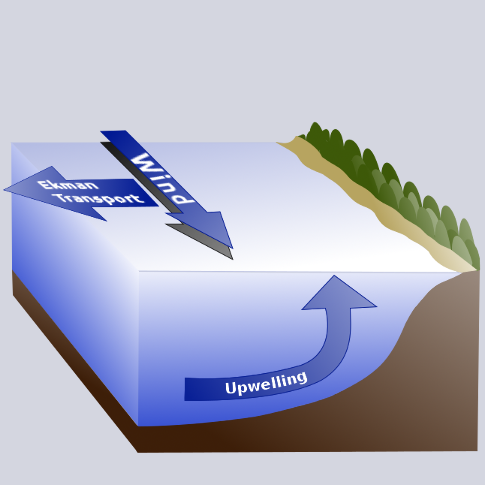

## What is a Coastal Upwelling Index?

::::: {layout-ncol=2}

::: {}

The coastal upwelling index is an index of the strength of the wind forcing on the ocean which has been used in many studies of the effects of ocean variability on the reproductive and recruitment success of many fish and invertebrate species.

Several upwelling indices and their differences are described in the tabs on this page, along with suggestions about the appropriateness of using each index:

- The Bakun upwelling index was developed as a simple time series to represent variations in upwelling along the coast. This index estimates surface transport from pressure fields using the geostrophic wind approximation. More than 7 decades of Bakun upwelling index are available.
- Newer upwelling indices CUTI and BEUTI are calculated directly from ocean reanalyses that assimilate satellite and in situ ocean measurements. Relative to the historical Bakun Index, these newer indices are limited in temporal and spatial extent but better represent the dynamics of the boundary current system.

:::

:::::

## ERD Upwelling Indices

The Environmental Research Division (ERD) has long been a leader in development and calculation of upwelling and other environmental indices. ERD was originally established as the Pacific Environmental Group at the U.S. Navy Fleet Numerical Meteorology and Oceanography Center ([FNMOC](http://www.metoc.navy.mil/fnmoc/fnmoc.html)) in Monterey, California, to take advantage of the Navy's global oceanographic and meteorological models. FNMOC produces operational forecasts of the state of the atmosphere and the ocean several times daily.  Before the advent of satellite oceanography, these forecasts provided global snapshots of ocean conditions for Navy operations, but were also invaluable for studies of fisheries climatology since they provided long time series of environmental conditions at a much higher resolution than was possible from direct measurement. The FNMOC sea-level pressure became the basis of the Bakun upwelling index calculation, and provides estimates of upwelling for the Northern Hemisphere starting in 1948 and globally since 1981. Long time series of upwelling index products have been established at 15 North American locations

As computational power and model resolution have improved over the years, ERD has endeavored to improve the upwelling index calculation.  Older indices are maintained to provide continuity for studies that rely on these long time series.

## Upwelling and Eastern Boundary Currents

Upwelling is a dominant driver of ecosystem productivity and variability in eastern boundary currents, including the California Current System which runs along the U.S. west coast. Marine ecosystems in the ocean's eastern boundary currents are highly productive, and capable of maintaining large standing crops of plankton, massive fish stocks such as sardines and anchovies, and major populations of marine mammals and sea birds.  Variations in upwelling over seasonal to interannual periods, due to large-scale shifts in wind patterns and atmospheric systems, are linked to variability in fish populations and other biological components in coastal ocean ecosystems.

What causes eastern boundary currents to be so productive? The frictional stress of equatorward wind on the ocean's surface, in concert with the effect of the earth's rotation, causes water in the surface layer to move away from the western coast of continental land masses. This offshore moving water is replaced by water which upwells, or flows toward the surface from depths of 50 to 100 meters and more. Upwelled water is cooler and saltier than the original surface water, and typically has much greater concentrations of nutrients such as nitrates, phosphates and silicates that are key to sustaining biological production.

The major eastern boundary currents include the Canary off the Iberian peninsula and northwestern Africa, the Benguela off southwestern Africa, the Peru off western South America, and the California Current System off western North America. Long-term time series of these ocean surface currents are not available, so estimates of upwelling strength (upwelling indices) are often used to help understand fluctuations in ecosystem properties ranging from temperature and density to distributions and abundances of top predators.

