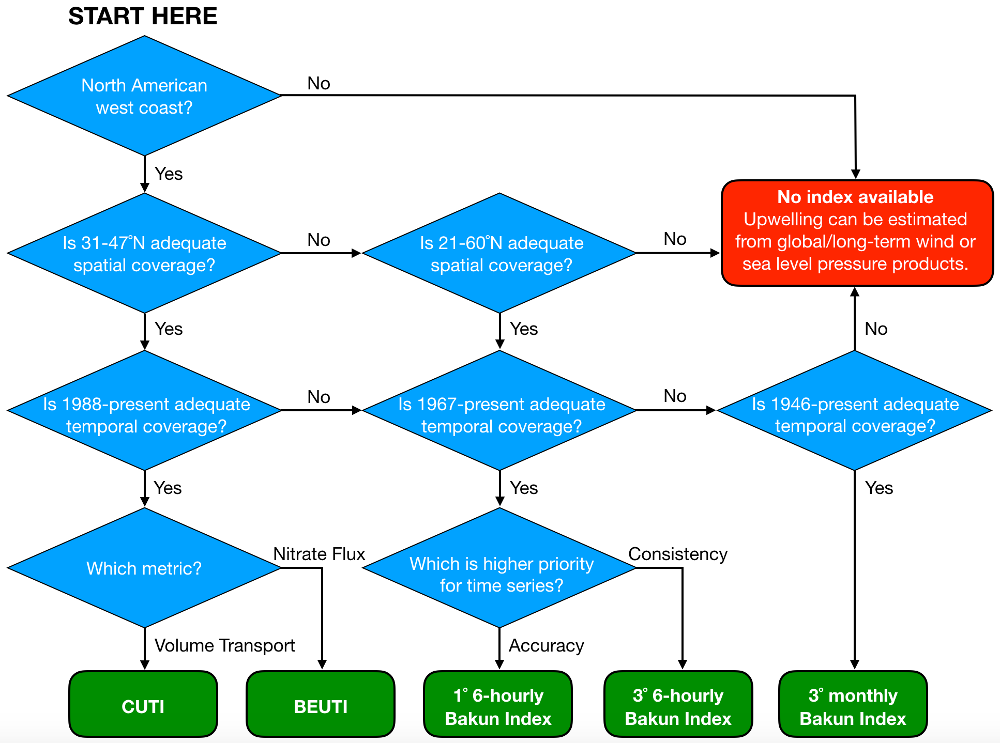

## {}
         
Use the chart below to find the appropriate index based on spatiotemporal coverage and attributes of the time series. In general, CUTI and/or BEUTI should be used if they cover the spatial domain and time period of interest. Otherwise, various versions of the Bakun Index can be used. Note that the different Bakun Indices are quite similar north of 39&deg;N, but farther south the different indices diverge and the choice of which to use becomes more important (see comparison under "[Differences Between Indices](diff.qmd)")

